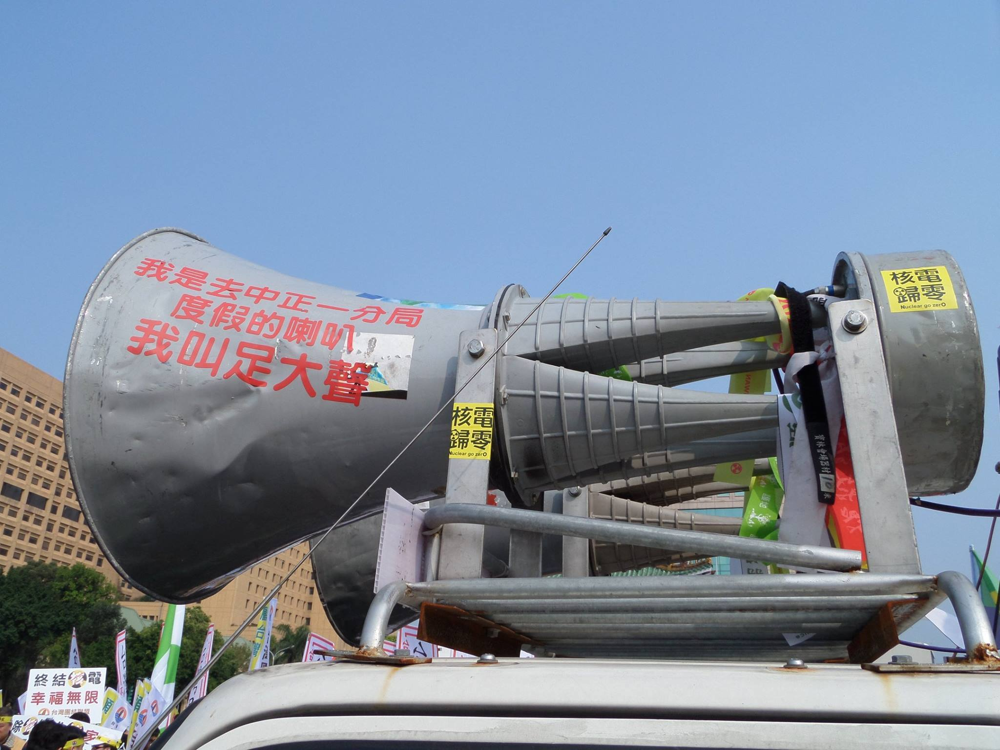

## 二十九、使用大聲公、宣傳車要注意什麼嗎？

### 說明規範：

在抗爭現場為了表達訴求與控制秩序，活動中難免都會用到大聲公或宣傳車等擴音設備，於抗爭現場須注意音量管控，否則警察可以依照《社會秩序維護法》第72條，以妨礙安寧秩序的名義的規定開罰。

### 實務上：

實務上，若抗爭現場音量過大，通常會由相關人員先行勸導，若未有改善的情形時才會依法開罰，不會逕自開罰。

### 建議或評估：

用擴音器的目的多是為了方便對群眾傳達訊息以及對社會表達訴求，警方通常對此並不會有太多的干涉，雖也曾經發生過警方沒收大聲公的事件，但並不是因為音量問題，而是為了癱瘓指揮中樞。若經過、處於噪音管制區（如醫院）時，主辦單位或主持人通常會提醒大家降低音量；若主持人沒這麼做時，可向工作人員反應降低音量，以避免遭人檢舉或蒐證而受罰，也可讓活動順利進行。

<figure>
  
  <figcaption>2014年428反核遊行上遭中正一分局沒收引發爭議的喇叭（本會提供）</figcaption>
</figure>
