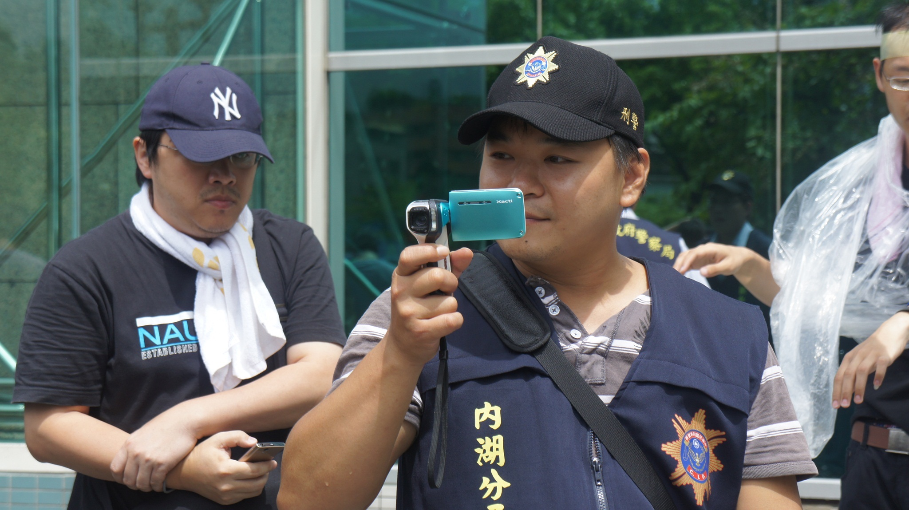

## 三十四、警察可以全程蒐證嗎？

### 說明規範：

如果警方認定集會遊行對公共安全有可能造成危害的可能時，在集會遊行期間可以使用錄影設備進行蒐證，而且可以保存作為調查犯罪之用。（《警察職權行使法》第9條）

### 實務上：

蒐證依照法律規定，只有對公共安全或秩序有危害之虞時，才可以發動，但實務上依照其作業程序的規範，或是其實際處理作為，均採全程蒐證；且蒐證工具之使用，由原先僅有特定警員配置蒐證工具之情形，慢慢轉變為個別警員隨身佩帶祕錄器。又警察亦會便衣蒐證，但由於警執法規定出示身分之要件，且便衣蒐證被發現後也容易產生不必要衝突，實務上已經漸漸減少使用，但於M503航線總統府抗爭中，仍使用了便衣警察進行蒐證，仍需多加注意。

### 建議或評估：

雖然有違反警執法第9條之虞，但警察也容易找出理由塘塞對公共安全或秩序有危害之虞時的要件控制，此時應進行反蒐證，讓之後司法程序對自己較有利，不會讓物證一面倒的偏向警察，保障自己的權利。

<figure>
  
  <figcaption>抗爭現場警方常見的蒐證方式（本會提供）</figcaption>
</figure>
