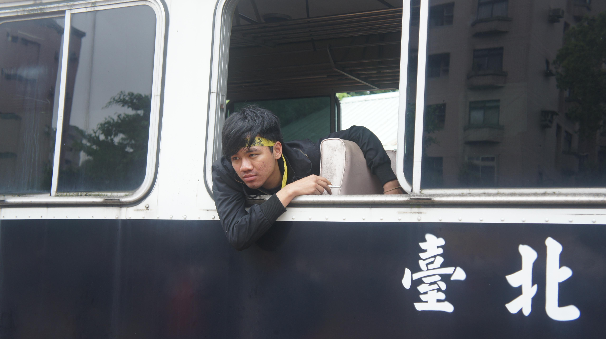

## 四十五、警察可以抓一整車人之後，載往遠處放掉（丟包）嗎？該怎麼辦？

### 說明規範：

依照《警察職權行使法》第28條第1項規定，警察為了要制止或排除對公共秩序或個人的危害，可以採取必要措施；又同法第27條規定，警察行使職權時，為了排除危害，可以驅離人車。警方通常以此為丟包的法源依據。

### 實務上：

一直以來，警察以丟包往遠處來處理抗爭群眾，避免其迅速回到現場，相當常見。由於法並未明定驅離後帶往何處，因此有時會將抗爭者載往交通不便的地方，例如深山中，但此行為違反比例原則，因為警察明明可以用更小侵害抗爭者行動自由方式的作法，但卻故意載往深山，有違最小侵害原則。

### 建議或評估：

丟包前：當被抓上警備車時，若如果想要影響警方驅離的效率，有人會故意卡在車門和不配合警察，並同時高喊訴求和口號，讓媒體關注。但要避免對警察的肢體動作與口角；當被被抬上車後，可以將布條貼在車窗上，增加曝光。另外也可以保持冷靜告訴警方不想上車，或說自己只是剛好路過，要求自行離開。離開後再考量是否就此離開或返回。

丟包時：如果被丟包時發現地點過於偏遠，可考慮一同向警察堅決聲明不要下車，並且要求警察將群眾載到交通便利的地方。此外，留意車上的夥伴有沒有受傷，如果有則要求警方送醫。再者最好和其他夥伴保持聯絡，適時回報狀況，以防大量逮捕而非丟包時律師支援不及。最後身上最好攜帶小鈔，當作交通費。

<figure>
  
  <figcaption>抗爭者遭警方押上警備車準備「被丟包」（本會提供）</figcaption>
</figure>
