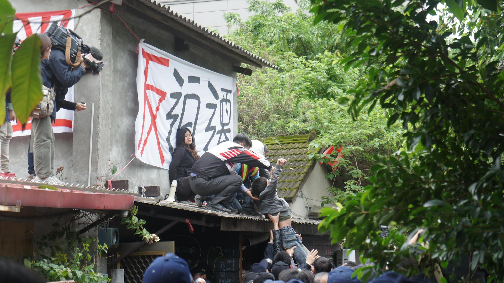

## 四十六、抗爭時被拖進警方的控制範圍，該怎麼辦？

### 說明規範：

《警察職權行使法》第28條規定，警方在制止危害公共安全、公共秩序、個人生命、身體、自由或財產的行為或情況時，可以依職權採取「必要措施」排除。

### 實務上：

在抗爭現場，如果被拖進警察的控制範圍，像是方盾陣型或人牆之內。通常就是會被警察施加暴力和集體毆打，且幾乎是在媒體及其他群眾難以發現和蒐證的範圍之內，所以當被拖進控制範圍，是非常嚴重且危險的處境。實務上雖然有被害人事後獲得國賠，但由於警方拒絕提供部隊與指揮官資訊，因此目前為止均未能追究施暴警察責任。

### 建議或評估：

如果被拖進去時，除了保護頭部外，建議可以大聲呼救或呼喊訴求，讓身邊夥伴能夠注意到你的情況，進而要求放人、協助送醫等等，並拖延警方執法及清空現場的時間。還手或叫囂無助於保護自己，很可能會激起警察的情緒而被打更兇。雖然困難，但盡量記住警察的編號或是長相，以便日後究責。

<figure>
  
  <figcaption>華光遭強拆現場（本會提供）</figcaption>
</figure>
