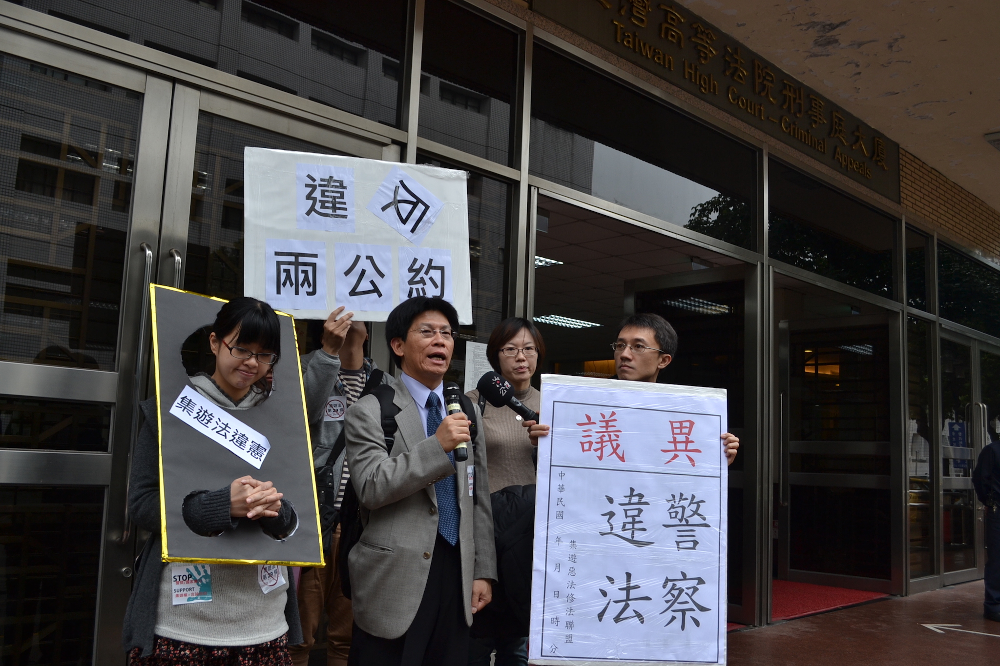

## 四十七、對警察執法的「異議」該怎麼做？有什麼作用？

### 說明規範：

對警察行為不服時可以依《警察職權行使法》第29條，要求執行該行為之警察開立異議單。只要當場口頭陳述不服原因，警察就有開立義務，不需要書面申請。另外，警察必須開立書面的異議單，不可以口頭回應

必須注意的是，縱然要求開立異議單，但是警察不當然停止其行為。如果警察認為不服的理由正當，固然應立即停止或更正；然而若警察認為陳述理由不夠具說服力，在法律上沒有義務停止或更正。

### 實務上：

目前法院實務上，還很缺乏透過異議制度成功提起行政訴訟，制衡警察違法作為的案例。而現場被要求簽發異議書時，警察也可能以沒帶、必須回派出所才能簽發（變相讓抗爭者自願離開）或是直接相應不理來搪塞。更糟糕者，則會在拒絕時同時誘使抗爭者與之口角，再以妨害公務送辦。

### 建議或評估：

由於法律仍規定有簽發異議書的義務，我們仍鼓勵參與抗爭者若有不服，應保持冷靜盡量異議，並蒐證與投訴不依法簽發的警員。不但能保障自身權利，也能使警方之行為受到法律約束，且事後也能依此進行法律追訴，一舉數得。

<figure>
  
  <figcaption>抗議集會遊行法違憲 警察濫權執法違反兩公約（本會提供）</figcaption>
</figure>
