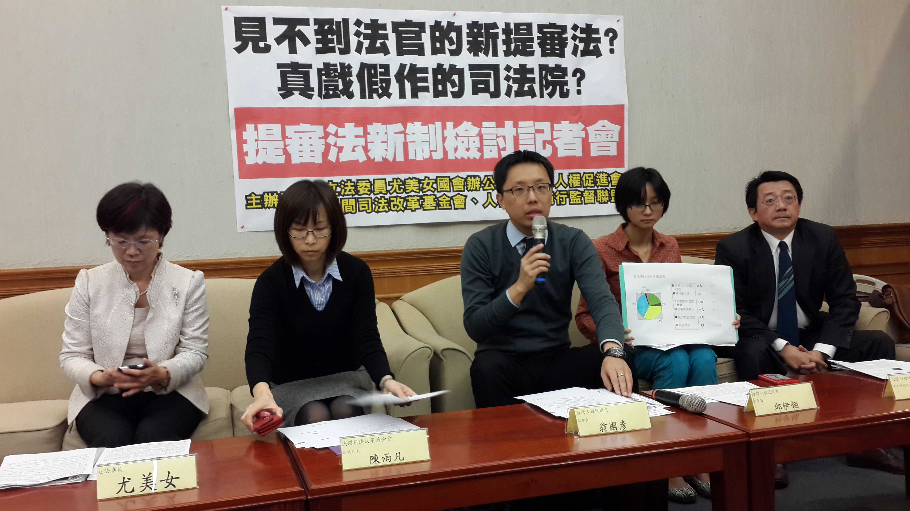

## 八十二、被警察帶回警局後警察就把我丟在一邊都不理我是怎樣？

### 說明規範：

警察將當事人（《刑事訴訟法》中一律叫作被告）逮捕之後，《憲法》第8條規定的24小時就開始起算，除非有《刑事訴訟法》中93-1的情況發生。只要警察把你帶走的行為被認定為「逮捕」，24小時就起算。

### 實務上：

常見的情況是警察先抓了人後，到派出所再找理由，最後可能會推拖說他不是在逮捕，只是在基於查驗身分的需要才會把你帶回警局等等（在此要注意的是，必須要在符合《警察職權行使法》第六條規定的情形下，警察才可以說要查驗人民的身分。然後根據同法第七條第二項的規定，如果警察用問的問不出來，或是要你出示證件你無法出示，雖然因為這樣而可以把暫時把你帶回警局，但只限3小時！並且是從被攔下來時起算！）。或者是主張是依《社會秩序維護法》強制要你到場，協助調查，各種名目來拖時間與事後合理化逮捕。

### 建議與評估：

如果警察似乎沒有要迅速處理案件的意思，又不想白白浪費時間，會建議當事人在被警方帶走前或被逮捕後聯絡律師、親友或現場的朋友，拜託他們幫你向法院聲請提審。當然自己也可以向警察提出，但未必會被理會。根據《提審法》規定，任何人都可以幫其他被逮捕拘禁之人向法院聲請提審！目前法院已有開設專門窗口受理提審事件。只要沒有《提審法》第5條列出的一到六款事由，法院就會在24小時內發提審票，讓警方把人交出來，之後由法院裁定是否應該釋放當事人。

<figure>
  
  <figcaption>檢討提審法新制記者會（本會提供）</figcaption>
</figure>
