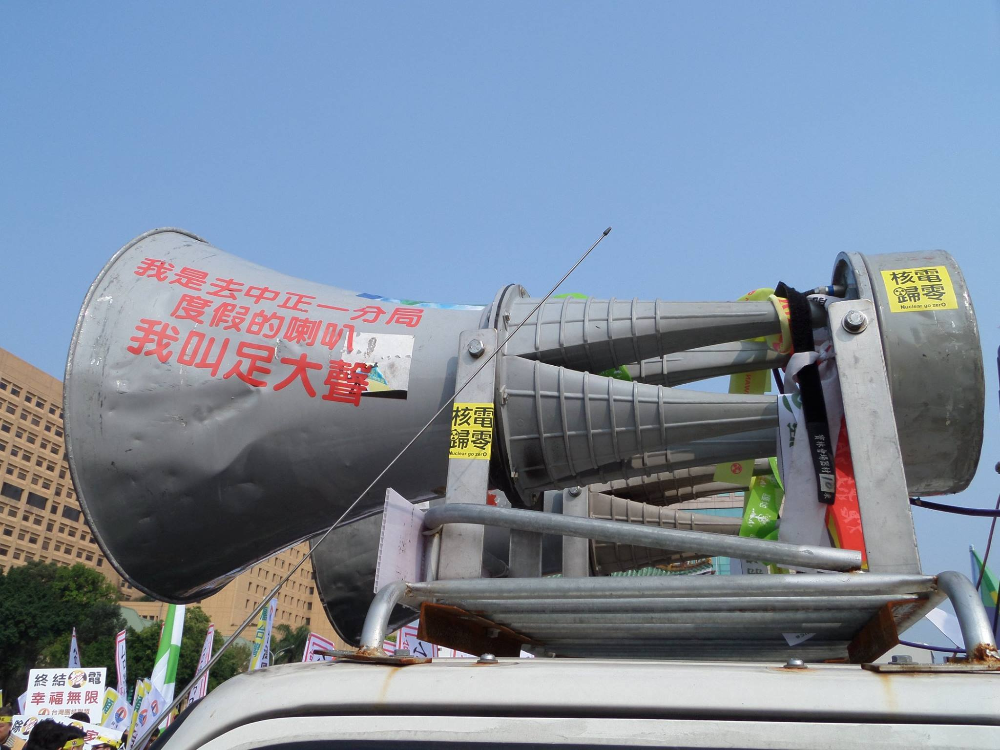
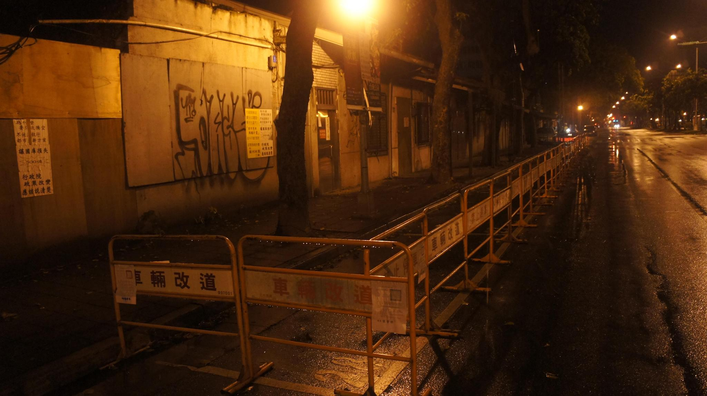
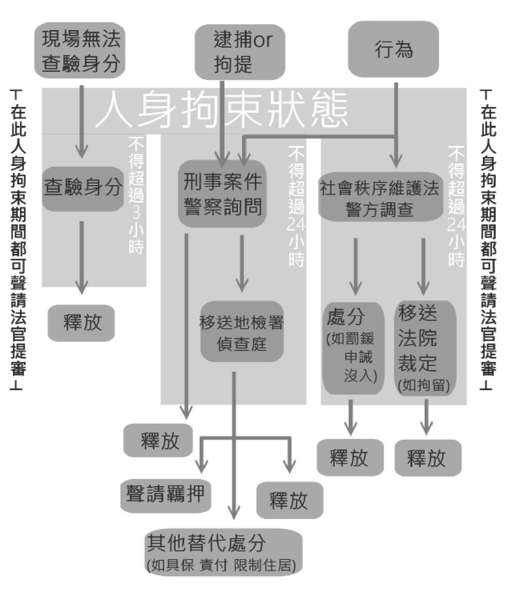

# 關於《抗爭防身手冊》

## 為什麼要編這本手冊？

想上街頭抗爭，會遇到很多來自國家的壓迫，有時候是警察的警棍盾牌，或是法院的傳票，往往會激起社會的同仇敵愾。但更多時候這些阻力是以更隱蔽的方式呈現，例如一通關切電話、一張罰單、甚至是一個警察的「好心建議」。在缺乏權力以及法律知識之下，抗爭者常常被迫妥協，或者付出代價，更糟的可能是不知不覺中建立了內心的小警總，束縛住了自己甚至是別人抗爭的可能性。

要全面性的對抗各種壓迫，我們不能只靠倡議修法跟義務律師，還需要所有人都能夠知道抵抗所需的基礎知識，以及必要時的求援或諮詢管道，讓國家無法輕易的利用對法律或檢警的無知與恐懼，讓抗爭者乖乖聽話。因此我們編了這本中文、貼近在地行動者需求、全面性地涵蓋常見情境、兼顧法律與實務、淺白易查、可免費取得的抗爭防身手冊。希望讓社會運動中許多本來僅是口耳相傳的知識與策略，可以在查證與整理後，讓大家都知道。透過這樣的方式，更有效的抵抗國家壓迫，降低行動風險與成本，撐開弱勢者的行動空間。

## 誰需要這本手冊？

1. 抗爭行動的組織者
  1. 街頭狀況百百種，就算是老手也不可能什麼都遇過，更糟的是現場往往流言四竄，這本手冊可提供在決策前參考的必要資訊。
  2. 在網路時代，動員來的群眾來自四面八方，不可能在事前一一說明、討論，在現場發放這本手冊，可以讓群眾在最短時間內擁有基礎概念，降低運動傷害，下一次繼續一起上街。
  3. 養兵千日，用在一時，把手冊中的法律常識與策略，加入組織培力的一環，讓行動時更加得心應手。
2. 抗爭行動的參與者
  1. 參加抗爭確實有風險，但又不能因此不上街，這本手冊可以幫助參與者迴避不必要的風險，以及評估自己在遇到狀況時，該如何行動。
  2. 在遭遇各種壓迫情境時，缺乏組織支援的個體戶是相當脆弱的，這本手冊幫助你在第一時間判斷情況、著手自保，以及有哪些求助管道。

## 這本手冊有什麼內容？

這本手冊首先將抗爭區分為「日常生活」、「抗爭之前」、「抗爭現場」、「抗爭之後」四個階段，以簡單的問題帶出每個階段可能會遭遇到的情境，並以五百字左右說明針對該情境的「規範」、「實務」、「建議與評估」，方便讀者迅速獲取實用資訊。 

## 手冊索取與意見回饋

這本手冊由台灣人權促進會秘書處以及「權打不義」志工團負責編纂，以台權會集會遊行權專案的經費進行出版，免費發放、索取，如有需要索取，或者是辦理推廣講座，都歡迎與我們聯絡，亦有線上版本(http://handbook.assembly.tahr.org.tw/)。若對這本手冊有任何建議或疑問，也都歡迎提供給我們(http://goo.gl/forms/QBjaVqat0g)，讓手冊内容更加完備。我們期待這本手冊未來能成為台灣社會運動的公共財，並且隨著時間不斷的修訂、更新，持續為每一代挺身而出，挑戰社會不公的抗爭者所用。

台權會將會持續蒐集最新的意見與案例，即時更新線上版手冊，並且定期改版紙本手冊。為了讓這本手冊更加完備且跟得上時代，我們需要您的寶貴意見。請將讀者回饋單回郵至「104臺北市中山區天祥路61巷22號2F台灣人權促進會收」，或上網填寫線上回饋表單(http://goo.gl/forms/QBjaVqat0g)，回傳者將致贈小禮物一份。

印刷、發送這本免費手冊，以及曰後修訂、改版的所有費用，均由台灣人權促進會的會務經費支出。作為完全拒絶政黨、政府機關經費補助的的NGO，我們的每一分經費均取自公民社會，用於公民社會。如果您也支持這本手冊背後反壓迫、護人權的理念，請[捐款](https://www.tahr.org.tw/node/1307)支持我們，讓台灣的人權，能走得更遠。

==========

# 在進入本文之前的小提醒：

在進入個別情境之前，針對一些共通性的注意事項，希望能在此先行提醒，提供讀者參考：

## 一、決斷無法迴避

這本手冊提供的是決策與自保所需的參考資訊，希望能讓抗爭者在盡可能正確而完整的資訊基礎上，做出比較周延的行動決策。但在實際抗爭時，是要冒險行動，還是安全第一，會碰到許多兩難甚至多難的情況，對此這本手冊並無法提供標準答案，仍須倚靠抗爭者自己的評估、決斷與承擔。

## 二、動員充分溝通

這本手冊整理了許多國家壓迫社會運動的手法，以及抗爭行動所面臨的風險，洋洋灑灑一整本，確實有可能嚇到參與者。但無論如何，國家依然會利用這些手段來對付抗爭。我們認為與其在不清楚的狀況下，讓參與者措手不及而受傷，不如在動員時充分溝通可能的風險，彼此在決定前都做好評估與準備，並應盡量準備好後援。即便有人因此退縮，這仍是該盡的責任。

## 三、惡法仍應挑戰

確實有許多現行條文有違憲疑慮，或是執法實務上經常有違法濫權的行為出現。我們把這些現狀告訴大家，並不代表肯定這些不合理的現狀，只是限於篇幅無法一一分析批判。即便提供了一些妥協作法，目的也是希望能保存抗爭的元氣，而非否定積極抵抗惡法的行為。我們一向致力於挑戰惡法，也歡迎每一位抗爭者以抗爭或訴訟改變不合理的結構，這點並未改變。

## 四、團結真正有力

國家壓迫帶給社會運動的最大傷害之一，是促成社會運動内部的分裂與鬥爭。例如鼓勵走溫和路線的組織，切割常進行高強度抗爭的組織，以換取警方給予的特權。運動遭到打壓時，也可能對内循著國家所劃定的法律框架，指責第一線的人是「戰犯」、「豬隊友」；或是反過來指責被抓者是「想紅」。結果導致社會運動力量被削弱，國家的統治權力越來越鞏固。路線的分歧很正常，但請千萬別忘記，面對國家壓迫時大家都是弱勢者，團結，才有力量。

## 五、隨時保持冷靜

情緒激動之下的推擠或口角，不僅無濟於事，反而會成為警方逮捕移送的理由。或者在過度害怕之下，不敢主張法律上的權利，也是矯枉過正。另外在過度不安的時候，亦容易聽信流言，不僅製造無謂的恐慌和猜疑，也會導致行動混亂。雖然不容易，仍應保持冷靜，觀察周遭動向，與主辦單位保持聯繫，全程確實蒐證，並明確表達法律主張，才是有效的抵抗。

## 六、尊重支援團體

目前有許多團體與律師，都願意義務協助社運抗爭所衍生出的法律問題，因此我們也建議遇到狀況時，盡量求助。但另一方面，也希望若需要協助，同時也可以尊重支援團體或律師，凡事充分溝通、配合，避免把支援者當作道具，不要隱瞞、欺騙、無故失聯、缺席法律程序或是做出其他過分的要求。

==========

# 日常生活

==========

## 一、好像被監聽了，怎麼辦？

### 說明規範：

依據通訊保障及監察法第五條與第六條，只有在特定情形檢察官可以聲請通訊監察書（就是監聽的許可）。比方有事實可以懷疑有可能構成最輕本刑三年以上或是內亂外患等等，理論上抗爭相關的罪名應該都不在這個範圍內。

### 實務上：

但實務上還是會有許多團體有疑似被監聽的經驗，例如警察透露了只有在電話聯絡中提過的訊息。關於技術上如何判斷，可從幾個現象來觀察：

* 手機異常的耗電或是電話費暴增：可能是監聽的人和你的手機在連線狀態中。
* 手機收訊良好卻撥不出去，以及市話的聲音變小、有雜音或是當分機拿起時，主機的聲音就變小。這些都可能是受到監聽線路干擾。
* 用手機打126，如果出現空號，那表示沒被監聽。如果出現嘟嘟嘟的聲音就表示你被監聽了。
* 用手機打自己的手機，如果出現語音信箱就沒被監聽，出現通話中，那你就是被監聽了。

### 建議和評估：

由於我們無法確定是否有無法被以上方式察覺的通信監察技術，還有所使用的通訊軟體究竟是否願意交資料給警察，因此必要時可採取以下措施：

* 避開可能被竊聽的場所（例如辦公室），並使用紙本資料與直接面談方式討論重要訊息。
* 日常即管理好手機、電腦，在討論重要事項時關機，放在遠處。

==========

## 二、警察來辦公室（NGO辦公室、工會或工作場所）拜訪，怎麼辦？

### 說明規範：

依據《刑事訴訟法》，搜索票需要有這些內容：

1. 案由
2. 應該被搜索的人或是物
3. 應該被搜索的身體、地方、物品、電磁紀錄（電腦、手機裏面的資料）
4. 搜索的有效期間。

如果不具備這些就不是搜索票，而且搜索票還需要有法官的簽名才會具有效果。

### 實務上：

警察要進入民宅一定需要搜索票或拘票，不然無權進入社區。除非有緊急狀況，比方說有明顯跡象你家有人正在犯罪或是逃犯被追趕進你家。如果警察沒有這些搜索票和拘票也沒有符合這些條件就闖你家，就有可能違反《刑法》307違法搜索或306侵入住居。

### 建議與評估：

當警察客氣的拜訪，想聊聊天時：

* 先詢問是不是有搜索票，警員的證件與編號等，再請警察在門外稍候，和夥伴討論清楚，是否讓其進門。

若當警察無搜索票但執意「拜訪」時：

* 預備錄音、錄影蒐證器材。
* 堅定的拒絕
* 若對方強行進入房內，可對外求援，例如有相關經驗的運動者、台權會、司改會等等。也可考慮找媒體，不過要評估曝光成本。
* 冷靜應對，抓住他們的怕事心態，客氣但讓他們覺得你不好惹。
* 資料小心存放，而且要小心不要被銬起來。

當警察持搜索票時：

* 詳細閱讀搜索票內容（人、時間、行使權限）小心警方違法。
* 聯繫認識的律師或法律扶助基金會。
* 對於搜索過程加以蒐證。
* 避免與警方的肢體接觸。抗拒可能受到不必要的強制，要小心評估。

==========

## 三、警察到家裡訪查，怎麼辦？

### 說明規範：

現行警察有關戶口查訪之規定，規定於《警察勤務條例》第11條第1項，還有《警察勤務區家戶訪查辦法》，以及警察執勤時之《警察勤務區家戶訪查作業規定》。對訪查大致上有幾項限制：

1. 要注重當事人的權益，而且行為必須要有辦法達成目的，也不能過當。
2. 不應該協助政治團體或是政黨而濫用權力。
3. 不應該洩露查訪得來的資料，要保守秘密。
4. 查訪的時候應該要穿制服、表明身分和查訪的目的。
5. 要經過被訪查的人引導才能進入室內。

### 實務上：

依內政部網站公告，目前均藉由「勤區查察處理系統」，以電子化資訊方式連結戶役政資訊系統，傳遞戶籍相關訊息資料。亦即現已少有警察會定期上門訪查，而是改用查巡合一的方式（訪查時間改為巡邏），除非主動向警察通報或是戶籍申請變更。

而實際上透過對抗爭者及其家人的「關切」來施壓，除警察訪查外，也可能透過其他管道，像關廠工人是勞委會就業輔導員「慰問」，順便告知抗爭狀況給家人。

### 建議或評估：

當遇警察上門查訪或約談時應：

* 先詢問事由，查看證件。
* 因訪查非強制性，可以拒絕。
* 如無法拒絕，則應蒐證記錄、通知其他當事人、NGO、律師等尋求協助。
* 事前對家人做好心理建設，告知訪查不代表自己犯罪等等，降低對家庭關係的衝擊。

==========

## 四、被老師跟教官約談，怎麼辦？

### 說明規範／實務上：

通常學校校規大多只有很抽象的規範，例如「態度傲慢污辱師長記大過」，或是「違反政府刑罰或故意騷擾不受約束記留校察看」這類型規範，所以應該要依個案去判斷不配合的狀況下可能產生的結果。

### 建議或評估：

建議可先委婉地拒絕或是先問清楚約談的原因以及老師的動機。若是在可能受到嚴重威脅時可考慮私下錄音，以便可以事後回顧，抄筆記，也比較容易在後續的處理中使用，做為證據或是回應用資料。並且要注意在約談過程中不要透露個人、他人、團隊，以及行動資訊給校方。只要能夠找到一套自己的論述，踩緊自己的立場，並以理性的態度跟校方溝通就好了，如果可以的話也可以尋求同儕或是校園人權相關NGO機構（如：人本基金會、台灣少年權益與福利促進聯盟）在資訊上或是心理上的支持和幫助，這樣的話應該可以不用太擔心面對這個問題。

==========

## 五、張貼、轉錄抗爭文章是煽惑犯罪嗎？

### 說明規範：

所謂煽惑犯罪，是指公然對開放的一大群人呼籲去犯法，甚至呼籲地很含糊也算，最須注意的是，就算被煽惑的人最後並沒有犯罪，公然煽惑的行為人仍是犯法。因此擴散抗爭訊息是否是煽惑罪，要看抗爭是否被認定為違背法令之行為。

### 實務上：

實務上由於煽惑罪一直以來有違憲的爭議，加上「違反法令」之行為範圍實在過廣，因此平常並不常被使用。但仍有抗爭相關案例，且不排除會作為網路情蒐後以偵辦煽惑罪為名，發動刑事偵查來遏止抗爭的可能性。

### 建議或評估：

宣傳的抗爭活動即便未申請，若為緊急、偶發集會，理論上亦可主張無許可亦非違法。不過在718釋字後，立院對於緊急、偶發性集會並未修法，目前是由行政機關認定，可以想見會傾向限縮緊急偶發集遊的範圍，目前法院見解尚不明確。因此若有顧慮，建議在宣傳上避免非必要又明顯違法之行為宣傳，單純表達訴求與號召表達意見，可降低風險。

==========

## 六、在網路上批評政治人物或企業是妨害名譽嗎？

### 說明規範：

罵人可分為公然侮辱與誹謗，公然侮辱罪禁止公開以「不屑、輕蔑」的方式侮辱別人的人格，例如三字經。而涉及事實面的爆料、批評則是涉及誹謗罪，與公共利益有關且能證明為事實者不罰。

另外在網路上罵人是否算是「公然」，需能看到po文的範圍，直接公開當然是「公然」，即便有設權限或PO文的版面並非完全公開，如果有可能進一步被傳播出去，仍算是「公然」。

另外根據《刑法》第311條，若對可受公評之事進行適當評論，就算是批評也不能算是妨害名譽。

### 實務上：

妨害名譽是作為發動策略性訴訟，遏止批評、抗爭的常見事由。針對避免構成妨害名譽的一些說法，說明如下：

* 針對帳號沒指名：若被罵的帳號能連結至個人，仍構成妨害名譽。
* 宣稱「作夢夢到的」：資訊來源與妨害名譽構成與否無關，宣稱作夢沒有免責效果。
* 用匿名帳號發言：雖然現在檢警要查網路IP並非漫無限制，但若平台業者配合提供資料，則仍有可能被告。
* 批評公眾人物：由於公眾人物應受社會監督，因此就算罵了公眾人物冷血等「侮辱字眼」，若從前後文理解，有構成適當評論的空間，有可能不構成妨害名譽。

### 建議或評估：

在以文宣批評訴求對象時，建議貼近事實與公共事務論述，避免捏造事實或無謂謾罵。是否構成妨害名譽必須考慮上述的諸多條件，並非僅看言論內容，所以新聞標題常說罵哪些髒話判有罪無罪沒有參考價值，別亂相信。若無法連結帳號與個人（例如粉絲頁），可降低訴訟風險。最後若判斷對方是希望以提告遏止抗爭，也不需屈服於寒蟬效應。

==========

## 七、平時被臨檢（身分查證）時要交出證件嗎？

### 說明規範：

依據《警察職權行使法》第六條，警察能夠臨檢的條件可歸納如下：

* 客觀的危險
* 要求警察要覺得有客觀的危險。比方說有事實可以判定為易生為害的交通工具、有事實可能造成本人或他人的具體危害等等
* 合理的嫌疑
* 有合理的理由覺得有可能會犯罪，警察也可以臨檢。比方說停留在藏匿犯人的處所或是在應有停留許可的地方。或是其他有合理懷疑的情況。
* 行經指定的管制區、管制站等場所。

### 實務上：

雖然警方應說明事由，實際上警察未必會嚴守法定要件，拒絕的話，可能會直接被帶到警局留置三個小時。而且就算你真的沒有犯什麼罪，也有可能因為你詢問事由被認為不合作，或符合一些警方常懷疑的特徵，而以其他理由把你帶回調查，所以交了也不保證不會被帶走。

### 建議或評估：

平時較少在出示後還被刁難的，因此若要避免麻煩可考慮配合。若剛好沒帶身分證，也可告知姓名、身分證號碼。若要力爭，可參考以下：

1. 手機錄影，將警員編號入鏡。
2. 主張依《警察職權行使法》第29條第一、二項表示異議，理由為警察不具合理懷疑就不當進行臨檢，並要將異議作成書面，之後將依此提行政救濟。
3. 警察找理由不肯開異議書，可直接打電話給分局，目前官方有要求應攜帶異議書，有些嚇阻作用。
4. 若事態惡化至被逮捕，聯絡律師或法扶陪偵。

==========

## 八、警察找我當線民，該怎麼回應？如何拒絕？警察可能的手法？

### 說明規範：

依照《警察職權行使法》第十二條的規定，警察在執行公務的時候可以選擇一般人祕密蒐集相關資料。如果被警察詢問意願（甚或是「要求」），人民都有權利拒絕，因為提供這樣的協助必須是出於「自願」的，才符合法律的規定。

### 實務上：

警察可能會以閒聊的方式找你說話，可能是想要套問資訊或者是找你傳話，也許和一般電視中會出現的那種警察和「線民」的形象不一樣。通常在組織較外圍的人，或是與被調查的核心成員有認識，但是並不特別熟稔的人比較容易被警方詢問相關問題，或是問及是否願意教長期提供資訊。有時候警方的意圖並不明顯，實務上較常以「閒聊」的方式和人民交涉，可能會先表示對運動的贊同，也可能有一些施惠的行為（請吃東西、或是在協調的時候有限度的讓步）讓運動者先放下心防，之後再從言談之間獲取資訊。

### 建議或評估：

而不管外觀上是不是警察，都最好保持相當程度的警覺心，避免將自己身分、組織的或是行動相關的資訊透漏給他人（像是媒體或是其他有心人士）。

==========

# 抗爭之前

==========

## 九、到底該不該事先申請？

### 說明規範：

目前台灣的集會遊行是採取許可制，因此除非是非立即舉行不能達成目的的緊急集會（例如抵抗突襲式的拆遷），或是無特定發起人的偶發集會（例如臨時透過網路集結抗議），基本上室外、涉及政治訴求的集會遊行都必須在六日前申請許可。緊急、偶發集遊雖經釋字718號解釋應予保障，但目前並未有相應修法，也未因舊法被宣告失效而完全開放，反而是行政機關逕行發布行政規則規範之。

### 實務上：

緊急與偶發的定義都是由警察所認定的，即便事後可在法院爭執，但在當下仍有可能被舉牌與驅離。但另一方面，就算是沒有來得及六日前申請，或是無法負荷相關行政流程，若先口頭知會警察，若行動規模與時間不大，也多半能被默許。然而，由於申請就一定得提供警方行動資訊，因此有一些行動性質是不適合申請的，例如對特定政治人物的快閃嗆聲、對特定區域的突襲佔領等等。

### 建議或評估：

因此建議以能否幫助行動的目標達成，來衡量是否應事先申請。若是希望降低不確定性與法律風險，甚至需要警方提供交管等服務，且被警察知道也不會造成妨礙，則事前申請或知會警方是可考慮的。若是行動被警察預先知道的話會造成妨礙，或是根本不可能被許可，也有把握能夠應對現場的突發狀況與事後法律風險，或者是抱持著反對集遊許可制惡法的信念的話，那麼也可以選擇不申請。

==========

## 十、該怎麼申請集會遊行呢？

### 說明規範：

如果是在室外，又非偶發、緊急集遊的話，就需填好申請表格、遊行的路線圖還有場地使用許可（路權）等等（詳參《集會遊行法》第九條），在六日前向場地所在分局申請。如提出後警察機關未在三日內通知，則依《集會遊行法》第12條第3項視為許可。

如果在室內就可以不用申請了，但是如果有用擴音器、銀幕之類可能吸引人群，擴散為室外集會的東西，還是要記得申請。

屬於偶發性、緊急性的集會遊行，可以不用六日前申請。依目前內政部行政規則，無發起人自行開始的偶發集遊不需申請，不立即開始則無意義的緊急集遊仍須申請，只是不受時間限制。

在申請前要先取得路權，以台北市為例，路權是屬於新建工程處的，需要交申請書、申請人的身分證影本、保證金繳納文件、存摺影本（為了退保證金）。 每次申請需以現金繳納三萬元保證金。

### 實務上：

要留意各縣市可能有不同作法，除了上述文件外，可能還需準備其他文件，所以申請前應該先查詢集會遊行所在地縣市的規定、提出的程序、以及所在地的管轄警察分局。

偶發、緊急集遊的規範與認定目前均操之於行政機關手中，態度傾向不予認定，先前曾有申請緊急集會的工運團體，被以「無場地許可」駁回。

### 建議或評估：

若評估需事先申請，則建議了解各縣市之規定後準備相關文件、於法定日期內依程序提出。並且並應隨時注意現場，針對不同情況（例：遊行中的突發活動、路線限制等）作好與警方進行協調的準備。

==========

## 十一、什麼情況下會無法拿到許可？該怎麼辦？

### 規範說明：

通常會無法拿到許可可能會是因為：

* 負責人或糾察員不具有完全行為能力，或是還沒服完刑（緩刑例外）
* 場地在禁制區（包含總統府、行政院、法院等等……
* 如集會遊行之申請不被許可，則可以在收到通知書之日起二日內以書面附理由向警察局或上級機關申復。上級機關在收到之後兩天內要回覆，再被駁回就可以走行政訴訟了。

### 實務上：

1. 若集會行動地點為禁制區，或負責人資格不符，一般不會真的去事先申請被駁回。
2. 警方經常不給正式的駁回處分，而是以拒絕收件、口頭勸退等方式避免留下駁回記錄，讓人民啟動救濟程序。

### 建議與評估：

如果遇到不被許可的情況，考量實際行動上的需要，因救濟程序冗長，無法因應活動需要，因此一面進行救濟程序，另一面也可考慮持續與警方協調、換人申請或是嘗試聯絡NGO（EX：民間司法改革基金會、台灣人權促進會）、政黨、民代或律師等尋求進一步意見。

==========

## 十二、警察可以隨意更改跟限制抗爭的時間、地點與方式嗎？

### 規範說明：

警方依據《集會遊行法》，不可隨意更改或限制抗爭的時間、地點與方式，除非有第14條（申請許可前）、第15條（申請許可後）涉及公共安全、交通秩序等所列舉的情況，才可為限制（許可前）或是撤銷、廢止、變更（許可後），但後者之撤銷、廢止或變更，應於集會、遊行前以書面載明理由，通知負責人；集會、遊行進行，亦同。

### 實務上：

雖然目前實務上警察機關多會予以許可，但其仍可依《集會遊行法》第14條、第15條分別為許可前之限制或許可後的撤銷、廢止、變更，擁有相當大的裁量權。使警方可能在上級機關指示、政治力介入下，對高敏感之議題的集會遊行（如2008年陳雲林來台、2014年撤銷公投盟路權申請），進行濫權審核。對於特定活動、或行經官署的路線等也可能予以變更或不予許可

### 建議與評估：

對於警方之限制、變更、廢止、撤銷許可等，可依《集會遊行法》第16條進行救濟，但此種手段終究緩不濟急。可同時警方不予許可或變更的部分進行交涉，尋求雙方皆可接受的方案，但也應討論底線與破局時的行動方案，和如何承擔非法集會的法律風險。

==========

## 十三、什麼情況應該跟警察協調呢？怎麼協調？

### 規範說明：

人民的集會遊行權是表意自由的一種，需要受到保障，而對這種自由的限制、剝奪要符合比例原則。所以為了保障人民之集會遊行自由及兼顧社會秩序之維持，警方應就集會遊行之現場之情況與人民溝通協調。

### 實務上：

需與警方協調之情況可能包含：

1. 需警方幫忙指揮交通或是維護路權
2. 避免集會遊行遭到不同立場的人破壞，以及防止參與者間的衝突
3. 延長現場地舉牌（三牌）時間，降低後續被認定為違法不解散的風險
4. 遊行中的突發狀況、或是一些比較儀式性但略有危險的活動（例：生火、放狼煙等）
5. 當認為員警過當干預行動進行時，要求指揮官約束部下停止相關行為。

### 建議與評估：

一般行動上為了避免與警方的衝突與後續的法律風險，可先行安排一位協調者向警方的指揮官確認情況、了解警方的態度。同時也可使警察較容易掌握情況，讓警察安心。溝通管道有利避免警方過度反應或急著驅離。但也要注意不要因此反過來成為警方勸退或者情蒐的管道。

==========

## 十四、外國人可以參加集會遊行嗎？

### 說明規範：

《入出國及移民法》第29條規定。外國人不可以從事和許可停留、居留原因不相符之的活動。但書則允許合法居留的外國人（解釋上要在台灣居留六個月以上）參加請願或是合法的集會遊行活動。但若是參加選舉等政治性意涵較高的活動，依照《公職人員選舉罷免法》第56條第四款以及第45條的規定，則外國人不能應邀參加。

### 實務上：

在實務上有很大的操作空間。若是參加集會遊行活動也是來台旅遊的部分行程和目的？如果那場集會遊行是突發性地而來不及在入境的時候預先申報呢？又參加集會遊行是不是屬於「法令未禁止的一般生活上所需的活動」，還有何謂「政治性」，也都取決於司法機關和行政機關的認定。

最早在入境時，入出國及移民署就有可能依照《入出國及移民法》第18條第十三款，以有害公共秩序為由直接遣返。實際上外國人參與集會遊行時，若在衝突中被警方逮捕或驅離後，就會啟動驅逐或境管。否則大多是在出境後，案件才被送至移民署審查，禁止其入境。因為程序不透明且不會通知當事人，救濟相當不易。

### 建議或評估：

實際上外國人單純參加大多數的集會遊行風險並不高，只是要注意自己言行，不要被警察盯上，讓行政機關有啟動相關程序的空間。雖然不易，但相關處分仍可透過行政訴訟、國賠等程序挑戰，且有成功案例。

310圖博抗暴日晚會（攝影：何宇軒）

==========

## 十五、公務員可以參加集會遊行嗎？

### 說明規範：

如果是不涉及選舉活動或是與政黨有關的活動，原則上並無法律限制公務員的集會遊行權。但若並非議題導向的集會遊行活動，而是為候選人站台，和政治團體有關的活動，依《公務人員行政中立法》第7條及第9條的規定，不可以在上班時間或勤務時間從事政黨活動，也不可以主持或發起支持或反對特定政黨、政治團體、候選人的集會遊行或站台助講。

至於「公務員」的範圍，目前任職於公立學校、學術研究機構等教育、研究人員，在未兼任行政職的情況下，並不受相關限制。另外，若和公職候選人是配偶或二等親，則可以公開助選。

### 實務上：

實務上對於公務員參加遊行的障礙，可能超越上述的法定範圍，除了上級直接的個別施壓，或普遍性的宣示不希望所屬公務員參與外，不同立場的民代也可能對有關機關施壓。對於法律雖僅限制支持反對特定政黨的相關政治活動，但因抗爭針對執政者乃是常態，因此往往會被擴張解釋至其他公共議題的表達上頭，混為一談。

### 建議或評估：

若只是下班期間參與無涉政黨的集會遊行，則不需太過顧忌。但若作為組織幹部，或者是較有名氣的個人、或想要著制服發言等等，就建議事前評估如何處理隨之而來的壓力，以及就運動而言負擔此一壓力是否值得。

==========

# 抗爭現場

==========

## 十六、怎麼判斷一個抗爭是合法還是違法？要是參加到一個違法的抗爭，該如何自處？

### 說明規範：

目前我國《集會遊行法》採許可制，除了緊急、偶發集遊之外，均需事前申請方為合法。另外即便有事前申請許可，也可能因為抗爭中出現違反法令或事前限制的情況，而被撤銷許可。倘若違法，依《集會遊行法》第25條，警察得警告、制止、命令解散該場抗爭，不過並非一律如此，依同法第26條，還需要考慮比例原則。

### 實務上：

實務上並不追究單純參加違法抗爭者的責任，至於現場警察的行動，與其說是純粹衡量憲法權利，其實也會受人數與強度影響。概略趨勢如下表所示：

<table class="table table-bordered table-hover table-condensed">
  <tbody>
    <tr>
      <td>高強度</td>
      <td>多人數</td>
      <td>無法驅離</td>
    </tr>
    <tr>
      <td>高強度</td>
      <td>少人數</td>
      <td>強制驅離</td>
    </tr>
    <tr>
      <td>低強度</td>
      <td>多人數</td>
      <td>傾向容忍</td>
    </tr>
    <tr>
      <td>低強度</td>
      <td>少人數</td>
      <td>原則容忍</td>
    </tr>
  </tbody>
</table>

違法時警方須舉牌三次以上才能驅離，驅離時可能產生被拉扯、毆打等強制力對待之情況，甚至是如水車、催淚瓦斯等，依照現場狀況和抗爭規模以及當局的態度，都會有影響。

### 建議或評估：

透過形式違法手段爭取正當訴求，並不罕見。因此遇舉牌時不用過度緊張，不過同時也可以思考，警方作為是否真的合法合憲。也要判斷不同階段的風險，包括受到驅離的風險、身體安全上的損害、事後受追訴的風險等，決定要走要留。但無論如何，應區分抗爭正當性與違法，並非抗爭違法就代表訴求不正當；同樣的也不必然一定要違法，違法的手段也並不保證效果。

==========

## 十七、舉牌代表的意義是什麼？

### 說明規範：

根據《集會遊行法》第25條，需要進行警告、制止、命令解散後，才能強制驅離以及追訴首謀，舉牌的意義在於具體化這三道手續，並且留下證據。

依照《集會遊行法》第3條規定，舉牌的人必須是分局正副局長。依行政程序法第100、第110條，必須要以適當方法使對方知悉，例如用擴音器明白說出首謀的姓名。

### 實務上：

舉牌次數與間隔法律沒有明確規定，但現行實務慣例認為至少要舉牌三次，且法院已將之納入比例原則之一環。舉牌間隔法院則是以比例原則和社會相當性原則作為判準，警方必須給予充分的解散時間。在實務上舉牌有時會刺激現場群眾情緒，但有時也會作為緩衝，行動者利用在舉牌第三次之前的時間完成行動，警方也透過舉牌動作宣示立場。

### 建議或評估：

警方常提出在一定時間內解散就不舉第三次牌，不追究法律責任，但這也會反過來壓縮行動時間與形式。若舉三次牌內就足以表達活動訴求，則可以喊完就離開，不必刻意製造衝突。

若決定不配合解散，可以讓被喊到的首謀宣告解散後離開，其他人繼續待在現場，實質延續行動。也凸顯由警方認「首謀」的荒謬。但要注意媒體也可能解讀成主辦人落跑，不負責任。警察也可能自己另抓替死鬼。

任何的協調都要盡可能對行動者公開透明，最好是一起決定，不要由協調者片面決定，以免被警方分化。一定要跟群眾說清楚過程與理由，才不會有人見縫插針。若警方有不合理的要求，也應盡量蒐證。

==========

## 十八、警察不配合做交通管制，如臨時不給車道/縮減場地的話，怎麼辦？

### 說明規範：

政府本應協助人民行使憲法基本權，依據《集會遊行法》第24條規定，主管機關可以依法請警方到場維持交通秩序，因此警方有在活動現場進行交通管制的義務。

### 實務上：

如果是有申請的遊行活動，基本上警方都會配合做交通管制，不然造成遊行群眾受傷或交通秩序混亂的話，反而增加警方自己的麻煩，不過未必會完全配合抗爭者的需求，可能會以交通優先。

如果是未申請的抗爭，就要看這次抗爭行動想要達到的效果來決定，如果本來就打算採取較激烈的手段進行，那警方不配合交通管制反而能夠癱瘓交通、影響更多人。若未有此打算而仍希望有交管，警察也可能怕麻煩或遭上級單位處分，並且希望掌握整個抗爭行動的狀況，依舊提供交管。

### 建議或評估：

若場地被壓縮，只要群眾人數很多而自然溢出，人群壓力可能使警方傾向讓步；但如果人很少，警方就會去縮減車道，這時候就必須要有負責協調者去跟警方交涉。或者也可以請有力人士去協調，例如民意代表、社會頭人、有經驗的組織者、學者，減少硬碰硬的情況，以求活動目的順利達成。此外，若預計有相關需求，籌備時也最好自行準備一定的交管人力，以確保警方不配合時，活動仍能順利進行。

==========

## 十九、在公共場所懸掛布條會怎麼樣？

### 說明規範：

集會自由的內涵，自然包括掛布條在內的各種表現形式。不過依照《集會遊行法》第18條，抗爭結束後必須清理。另外依布條的內容或形式，如果被警方認為有污辱公務員或是影響公共安寧、社會秩序的疑慮時，就有可能因違反《刑法》和《社會秩序法》被起訴或罰鍰。在長期抗爭時，也可能以廢棄物為由來清理。

### 實務上：

警察常會找理由來清除宣傳布條，例如Hydis工人在定點懸掛布條及擺設靈堂，被警方即以布條與擺設違反廢棄物清理法，還有讓附近住戶害怕違反《社會秩序維護法》為由強制清除；在苗栗後龍灣寶里的抗爭，即使農民是把布條懸掛在自己的農田中，警察仍然依廢棄物清理法拆除並罰款。

有案例是法院認為警察沒有違法，因為清理的行為有廢棄物清理法授權，且民眾仍有其他的抗議方式，不因布條被清掉就沒辦法表達言論。但有學者批評這個判決沒有考量到抗爭布條並非「實質的汙染物或廣告」，也沒有認定該布條屬於哪一種言論，過於侵害言論自由。

### 建議或評估：

在公共場所懸掛布條時，要注意是否有可能會破壞公物，建議在懸掛和清理之後可以拍照當作證明，避免被清理時損及牆面，還需要負額外法律和賠償責任。除此之外，內容也應避免妨害名譽，以免成為拆除布條甚至追訴抗爭者的藉口。因此，應依權衡運動目的與訴求表達效果，以及前述的法律風險，來決定布條內容和懸掛方式。但若被無理拆除，也可考慮訴諸司法，力爭言論與集會自由到底。

==========

## 二十、在公共場所噴漆會怎麼樣？

### 說明規範：

噴漆的行為可能觸犯侮辱公署罪（《刑法》140第2項）或毀損建築物罪（《刑法》第353條）；若該場所是古蹟，則也可能觸犯《文化資產保存法》94條。

### 實務上：

侮辱公署罪該罪嫌涉及人民言論自由的限制，依大法官509號解釋，國家應給最大限度維護，且公署本質上具有公益性，故對公署發表言論的容許尺度應比私人更為寬廣，況且侮辱公署罪已有立委提案建議刪除，因此刪除前對該罪自應從嚴解釋，才符合《憲法》保障言論自由意旨，故對於潑漆行為不起訴。

侮辱與毀損實務上認為該侮辱是無形的，如語言或文字；若為有形之行為，如潑漆等，應屬毀損罪之範疇。毀損必須毀壞建築物的重要部份，足已使建築物之全部或一部失其效用才能成立。潑漆還不至於讓建築不堪使用之程度，頂多是外觀不雅，這是民事求償之問題，與《刑法》無關。

毀損古蹟實務上有認為塗掉景福門屬古蹟範圍之黨徽並非具有毀損故意，而是言論表達之展現，即為了抗議景福門上的黨徽彰顯獨尊中華文化的意識形態，而將黨徽塗抹，此行為係表達其政治訴求，被告三人並未毀損古蹟。

### 建議或評估：

若有能力承擔刑責，則可以選擇潑建築物外觀；若無，可以選擇潑在地板，或選擇水性漆，較不該當。另外，除了《刑法》通常會附帶民事訴訟，需考量自身有無能力賠償相關費用。

318運動陳抗者於立法院建物上噴漆表達訴求（攝影：何宇軒）

==========

## 二十一、在公共場所發傳單會怎麼樣？

### 說明規範：

公共場所原則上可以發傳單，《集會遊行法》僅規範集會遊行，發送傳單並非集會遊行，應不受《集會遊行法》限制。但有些區域有特別法規定為例外，如《大眾捷運法》第五十條第七款規定，未經許可在車上或站區內募捐、散發或張貼宣傳品、銷售物品或為其他商業行為，會被處以罰鍰，因此捷運站雖為公共場所，但不能發傳單。

### 實務上：

實務上警察常以未申請之非法集會為由，禁止民眾發放傳單，如野草莓學運時，參與者想要到台北火車站散發傳單，途經總統府附近的公園路與介壽公園時，遭三十名警員圍堵，指學生違法集會，最後學生只好退回自由廣場。又一例為割闌尾活動時，參與者於十字路口各處發放傳單，警察也認為此為未申請之集會，禁止發放傳單。警察於管制發放傳單行為時，並不理會是否為集會，傳單之內容與目的為何，只須外觀有多數人聚集在附近，從事類似行為，即認定為集會而須申請許可。

### 建議或評估：

警察雖然無理由禁止散發傳單，但考量活動進行的順暢，或許可以考慮減少發放傳單的密集度，讓發傳單的人能夠更鬆散的發傳單，使警方很難判斷是否有聚集多人的外觀，或是難以判斷這些人是否同屬一個團體；或是以相同目的發送傳單，因警察不能確定是否屬於他認定之集會，因此可以減少警察管制強度，讓傳單能順利送到路人手中。

==========

## 二十二、向政府機關丟東西會怎麼樣？

### 說明規範：

此行為依結果不同，可能觸犯：若丟擲物品傷害到工作之公務員可能違反《刑法》第277條第1項之傷害罪及第140條第1項之侮辱公務員；或因丟擲東西而可能觸犯第140條第二2項侮辱公署罪，若丟擲物品造成該政府機關建物之損害則可能違反《刑法》第353條第1項毀壞他人建築物罪；該行為亦可能妨礙到公務員之工作而觸犯《刑法》第135條第1項之妨礙公務員執行職務罪。

### 實務上：

曾有原住民為了保護祖靈地，「蛋洗」公所表達抗議，法官認為丟雞蛋是對建物，不是對人，只是要表達憤怒、希望政府能傾聽民意，不是為了污辱公署，判決無罪。又除非是造成建築物重要部份損壞、或使建築物有部分無法使用，才會成立「毀壞他人建築物罪」；如果只是造成外觀不雅，並非不能使用，是屬於民事求償的範圍，和《刑法》無關。

### 建議或評估：

丟東西主要是為了表達訴求、及獲得行動的儀式性和媒體效果，因此只要達成上述目的就好，因此在丟擲物品上，要注意以下幾點：

* 丟擲物品盡量不要丟有殺傷力的東西，如石頭、鞭炮等，也可能招致警察介入，若不確定，就盡量配合主辦單位安排；又即使沒有危險性，也要考量到物品性質，如臭雞蛋若沾到警察，可能會讓警察產生報復執法的後果。
* 丟擲方式盡量避免瞄準警察，以免引起警方憤怒，進而有暴力鎮壓或將物品丟回抗爭群眾中，產生報復執法的結果，若不小心波及而被追訴，也可主張非針對警察。也要注意不要丟到前排的人。

國家帶頭關廠 國道收費員以雞蛋齊飛爭取勞動權益（攝影：何宇軒）

==========

## 二十三、向公務員丟東西會怎麼樣？

### 說明規範：

此行為依結果不同，若丟擲物品傷害到工作之公務員可能違反《刑法》第277 條第1 項之傷害罪及第140條第1 項之侮辱公務員；該行為亦可能妨礙到公務員之工作而觸犯《刑法》第135條第1項之妨礙公務員執行職務罪，或是屬行政罰的《社會秩序維護法》第85條妨害公務。

### 實務上：

比較知名的兩個案子，分別是「對江宜樺丟鞋案」以及「陳為廷丟鞋案」。

在對江宜樺丟拖鞋的案例，法院認為，聲援關廠工人雖然是言論自由，但以丟鞋來表達意見，會貶抑他人的人性尊嚴，也會危及他人安全，因此不屬於言論自由的保障範圍判處罰鍰。而陳為廷丟鞋案中，法院認為鞋子穿在腳下，一般人都認為鞋底不乾淨，陳為廷用髒鞋丟劉政鴻，對人身施以攻擊，有濃厚的羞辱意味，該行為已經逾越了合理表達意見的範圍，觸犯公然侮辱罪。

### 建議或評估：

雖然可以以此為抗爭手段喚起注意、表達不滿，但仍須考量事後的刑事責任是否可以承擔，自行評估風險。由上述法院的判決可以推知，考量到傷害程度和侮辱程度，雖然罰金或罰鍰的額度不高，針對公務員丟擲物品即便未成傷，仍有一定被罰機率。

==========

## 二十四、對政治人物嗆聲會怎麼樣？

### 說明規範：

法條沒有針對「嗆聲」做規範，但警察可能會將其認定為危害，特勤條例等規定逮捕，也可能觸犯《刑法》的妨害名譽罪。

### 實務上：

近年來警察實務對此管制嚴密，如2009年03月12日，馬總統從嘉義搭高鐵回台北的時候，高三林姓學生在高鐵站隔空喊了句「馬英九下台」，遭到警方當場逮捕被帶到派出所留置半個小時。警政署表示是依法規查證身分，並對可能危害元首安全的人採必要隔離。

### 建議或評估：

對政治人物嗆聲的後果要看當下是在什麼樣的場合發生，如果是在政治人物公開宣講的場合上，抗爭者嗆聲可能會被現場的警察或工作人員直接制止，而持續嗆聲也有可能直接被警察逮捕。建議是在嗆聲的同時表達訴求和目的，因為在當下政治人物和媒體都聚焦在嗆聲者的身上，訴求更容易被聽見，倘若不表達訴求，可能容易失焦而不能達成抗爭目的。

又在抗爭現場嗆聲政治人物並不會怎麼樣，但如果單獨太靠近政治人物嗆聲則有可能會被隨扈擋下或是被阻止。再者，如果抗爭者參與的是公聽會、說明會、聽證會等場合，若抗爭目的不是為了阻止會議程序進行，則建議基本上還是配合議事程序進行，並在發言時清楚說明自己的訴求和論述，並可在此時表達對政治人物的不滿。

消防員權益促進會訴求政府儘速補齊裝備與人力 莫讓同仁一再枉死火場（攝影：何宇軒）

==========

## 二十五、蒙面、戴口罩參加遊行會怎麼樣？

### 說明規範：

在集會遊行時，如果身上的打扮會讓身分無法辨識的話，主管機關可加以制止，甚至還可以命令解散。（《集會遊行法》第14條第6款、《集會遊行法》第25條第2款）

### 實務上：

目前《集會遊行法》雖禁止蒙面，但實務上警察對此並不注意，鮮少產生問題。蒙面或戴口罩之場合，僅為觸及對於社會較敏感之議題時出現，如早年之同志大遊行，有鑑於社會對於同志的誤解和偏見，參與之同志均不肯表明其身分進而戴口罩或蒙面；不過近年則較多是為了表達自我而進行扮裝。另外亦有護家盟反對同性戀婚姻遊行，也戴口罩蒙面，避免他人認出。

### 建議或評估：

基本上實務操作並不特別針對此問題，且社會對於某些族群仍有誤解與汙名，倘仍顧慮上述考量，應仍可選擇不露面。也不需為此放棄扮裝。

==========

## 二十六、如何處理抗爭現場不同立場之衝突？

### 說明規範：

法律允許主辦單位，安排配戴有「糾察員」字樣的工作人員，協助維持秩序；如果現場有民眾妨害集會遊行的進行，負責人或糾察員可以要求對方離開現場。因此，若去不同立場的場合抗爭、表達不同意見，有可能會被認為是妨礙集會進行，而且警察會協助主辦單位來進行處理。（《集會遊行法》第20、21條）

### 實務上：

實務上雖然警察會在旁邊控制現場秩序，幫忙隔絕意見不同者，其理由常以已經申請路權而為之。但是，警察有時會因為自身政治主張的不同，而採取不平等的行為。可能會刻意阻止與自身立場不同的群眾鬧場，無視與警察自身立場相近的人的誇張行徑。此外，就糾察隊的使用，有發生護家盟的成員以手牽手圍住的方式限制不同意見參與者的行動自由，引發不少爭議。

### 建議或評估：

就主辦方而言，若認為活動性質本來就是鼓勵多元對話，則可提供場所給立場不同者發表意見，並安排糾察照應，促成對話但防止肢體衝突；若較擔心活動無法進行，或可請不同意見者在隊伍、會場周邊發表意見。若去立場不同的活動的表示反對的聲音，行動的干擾性越強風險越高。如果對方是公開活動，可以積極呼籲對話；如果是不公開、封閉活動，則要小心當場發生衝突的風險。

若判斷有危險，可以請求警方區隔雙方，但不要要求警方限制對方行動，除非對方嚴重影響你的集遊進行。因為這會給警方介入、干涉的機會，也侵害對方的言論自由。

台灣宗教團體愛護家庭大聯盟發起遊行主張「一男一女」、「一夫一妻」的婚姻價值（攝影：何宇軒）

==========

## 二十七、靜坐封鎖、阻擋道路或建築物出入口會怎麼樣？

### 說明規範：

同樣是靜坐，所涉及的法條卻會因行為態樣之不同而相異。

用靜坐來阻擋第三者出入，可能觸犯《刑法》第304條第1項的強制罪；另外，也有可能違反《社會秩序維護法》第64條第1款的妨礙安寧秩序之處罰。

用靜坐來封鎖道路，除了違反上述兩條法律，更可能違反《刑法》第185條第1項的妨礙公眾往來安全罪，以及《道路交通管理處罰條例》第82條第1項第9款阻礙交通。

### 實務上：

如果靜坐、阻擋的行為嚴重影響交通和公務進行，很可能會很快地被驅離及排除。但是實際上看政治人物的決定，還有參與者的人數與強度等，都會影響警方採取行動的速度與強度。

### 建議或評估：

一般要確實執行這類行動，需要相當的組織能力。另外抗爭者要明確表達訴求，如台灣農村陣線佔領內政部，影響民眾、內政部員工的上班路徑，目的就是為了讓他們瞭解因為群眾的佔領讓他們必須繞路感到麻煩，一定更能體會公務員自己微不足道地蓋章和轉送公文都有可能影響其他人的生活和住家被拆。而現場靜坐和阻擋的人建議是能夠透過網路社群（臉書、LINE）、媒體將自己的訴求傳送出去，讓更多人關注和前往現場聲援。

428廢核大遊行群眾佔領忠孝西路（攝影：何宇軒）

==========

## 二十八、在公共場所不能用火嗎？

### 說明規範：

在抗爭現場用火，通常不外乎是炊食或是抗爭行為的表現方式，因此應不會致生危險。這方面現行法規並無相關規範，亦不符合《刑法》公共危險罪章的構成要件，基本上沒有法律上之爭議，但警察可能會以《集會遊行法》、公共危險、妨害公務等移送。

### 實務上：

若無跟警方事先知會，有很大的可能會遭到阻止。但亦有曾先行知會，警方也答應，卻於現場反悔出面阻止的情形發生。例如有抗爭者想要以燒紙錢的方式，抗議政府不替人民著想，不如燒給陰間的好兄弟，諷刺政府的無能軟弱，並事先將此抗議方式告知管轄之分局，協調後警察承諾維持秩序，允許以燒紙錢表達訴求，但在活動當天警察卻違反承諾，以違反《集會遊行法》、公共危險罪（燒紙錢）、妨害公務罪移送，事後法院也判處40天拘役。

### 建議或評估：

如果用火的目的是為了抗爭行動的進行，無論是儀式性的活動或是野炊，都會在事前或當下告知警方用火的原因，並且與警方協調，因為如果沒有告知或協調，都可能會被警方所干預和制止。作為一種策略性的手段，如非必要的情況下，盡量告知警方用火的需求，來取得警方的信任，讓訴求能被彰顯出來。例如過去有抗爭行動有放狼煙的儀式，都會先和警方說明用火的目的和程序，告知後基本上都不會被阻止用火。最重要的是用火表達意見時，參與者應考量到身邊群眾和一般大眾的人身安全。

==========

## 二十九、使用大聲公、宣傳車要注意什麼嗎？

### 說明規範：

在抗爭現場為了表達訴求與控制秩序，活動中難免都會用到大聲公或宣傳車等擴音設備，於抗爭現場須注意音量管控，否則警察可以依照《社會秩序維護法》第72條，以妨礙安寧秩序的名義的規定開罰。

### 實務上：

實務上，若抗爭現場音量過大，通常會由相關人員先行勸導，若未有改善的情形時才會依法開罰，不會逕自開罰。

### 建議或評估：

用擴音器的目的多是為了方便對群眾傳達訊息以及對社會表達訴求，警方通常對此並不會有太多的干涉，雖也曾經發生過警方沒收大聲公的事件，但並不是因為音量問題，而是為了癱瘓指揮中樞。若經過、處於噪音管制區（如醫院）時，主辦單位或主持人通常會提醒大家降低音量；若主持人沒這麼做時，可向工作人員反應降低音量，以避免遭人檢舉或蒐證而受罰，也可讓活動順利進行。

2014年428反核遊行上遭中正一分局沒收引發爭議的喇叭（本會提供）

==========

## 三十、翻過政府機關的圍牆或衝進機關大門會怎麼樣？

### 說明規範：

此行為可能觸犯《刑法》第 306 條侵入住居罪，若造成物品損害也可能構成《刑法》第354條毀損罪。

### 實務上：

隨著運動的升溫，主持人可能會宣布進佔政府機關癱瘓其運作以喚起更大的注意。在最近幾場有占領機關行為出現的抗爭，後續多有人因此受到司法追訴。因此在在顯示目前當權者對於人民的聲音往往想方設法打壓，並不會出現回心轉意的情形。因此目前占領機關的成效多是喚起社會更大的注意。

### 建議或評估：

雖然占領政府機關的確能引起社會更大的注意，但依目前官方的處理態度來看，有很高的可能會受到司法追訴。如三二四行政院事件的確引起社會關注而拉高了運動溫度，但也因此有許多人後續遭受到行政院的司法追訴。所以如果在抗爭現場可預見或有預告將有占領機關的行為出現時，要先自我評估是否有能力可以承擔後續可能的代價，主辦單位是否有充分準備，再去考慮是否一同行動。

==========

## 三十一、警察開始驅離時要注意甚麼？夥伴被警察毆打或拉走，我該動手救他嗎？

### 說明規範：

當警察在現場強制驅離時，直接前往阻止，即有可能觸犯《刑法》第135條對於執行職務公務員施以強暴脅迫罪，及《刑法》第140條侮辱公務員罪。

### 實務上：

雖然警察在驅離時的武力使用不應超過必要範圍，然而實際上過當的武力使用經常出現，這讓現場的抗爭者經常陷入是否要冒著妨害公務危險保護夥伴的兩難，或是在自己被警察攻擊時，直覺出手自衛而遭到追訴。

### 建議或評估：

一定要保持冷靜，避免直接出手推打警察，如此不僅無效也有可能讓自己陷入險境。首先應進行蒐證，記錄下警方的臉孔、編號和毆打的行為，貼在身上的秘錄器會比手機理想。而較有效的自衛手段是避免落單，如果有人落單，則是想辦法盡快把他拉回群眾的範圍之內。至於個人層次，則應注意保護頭部，盡量著長袖輕便衣物，若有易碎、會掉落的配件與貴重物品，應先收好或托給朋友。

若只是被抬而無被攻擊危險，不要喊警察打人，要喊口號，不然記者只會拍警察打人的畫面出去，讓訴求失焦。被抬的時候建議全身放鬆、不要拉扯，這樣警方比較難施力，可以爭取表達訴求的時間，而且被抬的人也比較不會受傷，注意不要讓單獨部位落在地面，以免被拖行而擦傷。

最重要的是，如果強制驅離即將開始，要自主離開的人就要做好準備。這不是逃跑，不逞強才能夠持續參與，不要等到被驅離了才走。

==========

## 三十二、跟警察有肢體接觸就是妨害公務嗎？

### 說明規範：

若是與警方發生推擠衝突，即便並非蓄意或是沒有造成警察任何損傷，仍有可能會依《刑法》第 135 條對於執行職務公務員施以強暴脅迫罪移送。所謂依法執行職務，應指執行合法的職務，違法的職務並不在保護範圍內，且此合法職務更須在該公務員之職務範圍內，才受本罪保護。如何判斷是否合法，應該著重在外觀形式上能否認為是職務行為，不以實際上正確與否為限。又此罪只要有強暴脅迫之行為產生就成立，不需要造成公務員無法順利執行職務為結果。

### 實務上：

實務上警方常常只要有一點接觸就會說你妨礙公務，甚至刻意用一些行為誘導你和他拉扯或產生衝突，在拉扯和接觸的時候，有時蒐證影片看起來會很像是行動者在拉警察。抗爭者一般會主張言論自由、是要表達訴求並沒有妨害公務意圖、還有與警察的實力懸殊不構成強暴。檢方對妨害公務的見解對抗爭者並不友善，法院目前則是寬嚴不一。

### 建議或評估：

應該盡量避免跟警方糾纏、拉扯之行為，因為在拉扯的時候，警方之蒐證影片可能看起來會很像是行動者在拉警察，可能會被認定為強暴脅迫而妨礙公務員執行職務。總之在肢體跟語言上都盡量不要跟警察發生無謂衝突，以免警方藉此進行驅散或逮捕。若是因訴求表達上的需要，或是擦槍走火而被追訴，則應尋求律師協助，謹慎辯護。

==========

## 三十三、跟警察起口角就是妨害公務嗎？

### 說明規範：

當警察在抗爭現場出現，應為執行其職務，若發生口角，常以《刑法》第 140條侮辱公務員罪送辦。但學者認為在民主社會有表達意見的權利，因此若是執行公務的手段或是其內容、公平性、正當性、適法性等有討論空間時，出於合理評論，指摘警方的錯誤，或是理性表達其不當，並不會構成本罪。

### 實務上：

如果行動者一時情緒激動而與警方起口角，即便只是質問警方並沒有口出惡言，仍有可能以《刑法》第135條妨礙公務或是本條移送法辦。

### 建議或評估：

在抗爭行動時，警方時常會刻意挑釁群眾，來讓抗爭者因被激怒攻擊或辱罵警察而被以妨害公務或是侮辱公務員的名義逮補。因此，抗爭者如果遇到這種情形，盡量冷處理、完全不理會警察的作為，避免肢體跟語言的接觸和衝突。以免警察找理由逮捕或採取其他行為。

==========

## 三十四、警察可以全程蒐證嗎？

### 說明規範：

如果警方認定集會遊行對公共安全有可能造成危害的可能時，在集會遊行期間可以使用錄影設備進行蒐證，而且可以保存作為調查犯罪之用。（《警察職權行使法》第9條）

### 實務上：

蒐證依照法律規定，只有對公共安全或秩序有危害之虞時，才可以發動，但實務上依照其作業程序的規範，或是其實際處理作為，均採全程蒐證；且蒐證工具之使用，由原先僅有特定警員配置蒐證工具之情形，慢慢轉變為個別警員隨身佩帶祕錄器。又警察亦會便衣蒐證，但由於警執法規定出示身分之要件，且便衣蒐證被發現後也容易產生不必要衝突，實務上已經漸漸減少使用，但於M503航線總統府抗爭中，仍使用了便衣警察進行蒐證，仍需多加注意。

### 建議或評估：

雖然有違反警執法第9條之虞，但警察也容易找出理由塘塞對公共安全或秩序有危害之虞時的要件控制，此時應進行反蒐證，讓之後司法程序對自己較有利，不會讓物證一面倒的偏向警察，保障自己的權利。

抗爭現場警方常見的蒐證方式（本會提供）

==========

## 三十五、警察可以趕走記者嗎？

### 說明規範：

大法官第689號解釋認為，為維持民主多元社會正常發展，新聞自由是不可或缺的機制，應受《憲法》第11條所保障；其又認為新聞採訪行為，是提供新聞報導內容所不可或缺之資訊蒐集、查證行為，也在新聞自由所保障的範圍當中；且新聞自由所保障之新聞採訪自由，不只是商業媒體的記者有，也保障公民記者或是一般人的新聞自由。警察若要限制採訪，須以法律或法律明確授權之命令為之，且須符合比例原則，不得任意禁止。

### 實務上：

警察通常以妨礙公務之名義驅趕記者，阻止其進行拍攝和採訪，若不遵從就以妨礙公務之名義進行逮捕，或直接以警力驅離，有時會傷害到記者。如424天橋驅離記者事件中，記者於天橋上拍攝警察驅離民眾之畫面，理應不會妨礙到警察驅離作業，但警察仍以妨礙公務之理由，禁止記者進行拍攝與採訪。

### 建議或評估：

若警察要進行武力驅離而難以力爭，則可以盡可能記錄後撤離，並傳遞此訊息。一方面保護後來之記者，一方面凸顯警察侵害記者採訪自由之行為，再評估是否之後要和警方進行爭訟。但同時要注意的是，並非主張自己是記者就代表一切行為免責，若是同時又去參與抗爭行動，則其行為並無法主張新聞自由的保障。

對抗爭者而言，記者若被驅趕代表著現場的風險升高，要提高警覺；也必須時時自備蒐證工具，不能完全倚賴關鍵時刻可能會缺席的記者鏡頭。

==========

## 三十六、警察可以要求新聞採訪者（公民記者、直播主）待在「採訪區」或穿「採訪背心」嗎？

### 說明規範：

我國並無相關之限制規定，故依大法官689號解釋認為，記者享有採訪自由，不受警方此要求之限制。故對於要求記者待在「採訪區」或穿「採訪背心」，僅警方片面要求，相關行政規則也沒有強制力。記者需要在抗爭現場機動進行取材與報導，要求記者待在「採訪區」或穿「採訪背心」會喪失記者之自主性，並限制記者之觀點，無法確保新聞媒體能提供具新聞價值之多元資訊，也無法促進資訊充分流通、滿足人民知的權利、形成公共意見與達成公共監督，故將破壞民主多元社會正常發展。

### 實務上：

實務上此為警方對於空間之控制，對於不配合之媒體，可能有干擾攝影、驅離、逮捕，甚至武力攻擊之可能性也有。發生衝突時，要求媒體進入採訪區接受保護，否則視為抗爭者，一同加以逮捕或驅離。另外警方經常以「認不出記者」為妨礙採訪之藉口，並藉此要求記者有待在採訪區或與警方媒體聯絡人聯繫的義務，方便辨識。不過實際上大多正是因為被認出來是記者，才被從現場優先排除。

### 建議或評估：

目前由於媒體普遍抵制相關措施，因此相關要求均未強制執行，建議持續抵制、無視相關要求，維護新聞自由採訪空間。不過若警察要進行武力驅離，仍回到自身安全與採訪工作的權衡，可以盡量記錄後撤離，並傳遞此訊息，一方面保護後來之記者，一方面凸顯警察侵害記者採訪自由之行為，再評估是否之後要和警方進行爭訟。

（攝影：何宇軒）

==========

## 三十七、要怎麼判斷會不會被強制驅離？

### 說明規範：

根據《集會遊行法》第25條，需要進行警告、制止、命令解散，也就是所謂的舉牌三次後，才能強制驅離。

### 實務上：

雖然舉牌三次前基本上都不太會驅離，但也不排除警方有特殊考量，迅速舉牌動手而不及撤離的情況。或者在較長時間抗爭之下，警方可能早早舉完三次牌後，再伺機而動。

### 建議或評估：

除了舉牌三次外，尚有一些可以參考的驅離訊號：

* 陣型與警械警察的長方盾（搭配長棍），主要是用來列陣阻擋群眾、和反制群眾的推進行動，因此即便用列陣執行驅離，也會是慢慢推出去的。圓盾則是搭配短棍，會以小組脫離隊伍進行機動攻擊或逮捕，危險性較高。
* 人數如果警力只有群眾的一倍，通常是擋住出入口或隔離；如果有三～五倍，他就可能進行驅離；若是十倍以上，通常是大部分人已經被驅離了，此時警方可能從驅離轉為圍困，有被圍毆的危險。
* 時間驅離最常發生的時間是行動開始後一到兩小時內，或是半夜10到12點（因為不希望群眾過夜）、凌晨3到5點（不希望影響上班車潮；而且這時候群眾最累、一般民眾在睡覺所以社會關注最少）、早上7到9點。

但以上都是僅供參考，不是百分之百現場仍應隨時注意各種動向，組織者也應維持警戒和應變的準備，時間拖長時訊息會很混亂，必須善加篩選來源，避免過度恐慌。

==========

## 三十八、到場時發現現場是管制區的話該怎麼辦呢？

### 說明規範：

關於廣義的管制區，概念上可以分為法律明定的禁制區和主管機關臨時劃定的管制區。禁制區是依《集會遊行法》第6條，包括了立法、監察院以外的五院、總統府與官邸、法院、機場、港口、軍事設施、外國駐台機關與官邸等周邊區域。至於管制區，雖然《警察職權行使法》第6條與《道路交通管理處罰條例》第5條均有相關規定，但應分別遵守處理重大公安事件或維持交通安全的要件，效果也是可查證身分或禁止人車出入，理論上不應拿來針對集會遊行。

### 實務上：

禁制區由於是法律明定，因此沒有合法集遊的餘地，一舉行警察就可能舉牌，但近年來有許多經協調後平安落幕的案例。至於管制區，雖然各有其條件以及效果，但實際上警察經常為了排除抗爭方便，就事前隨意劃設管制區，作為遏止抗爭者使用公共空間的手段，並不真的遵守相關要件與效果，法院對此的見解到目前為止均相當寬容，只要警方宣稱管制區，並不細究其劃設以及在區內所執行的公務，是否逾越法律授權。

### 建議或評估：

若必須去禁制區集遊，則事前可考慮與警察協調，或者做好若被舉牌、驅離應如何應變的準備。至於遭逢臨時劃設的管制區，由於法律上其實僅賦予警察進行身分查證與以交通理由排除人車的權限，並非一踏進即有罰則或禁止集遊，因此仍可視組織實力以及現場員警執勤態度，考慮繼續活動。惟在與警察交涉過程中要小心，避免遭控妨害公務。

==========

## 三十九、現場都被改道牌、拒馬圍起來了，怎麼辦？

### 說明規範：

首先，如果只是單純移開改道牌或拒馬，應該不會有刑罰的問題，但可能會因為擅自設置或變更道路交通標誌、標線、號誌或其類似之標識，觸犯《交通道路管理處罰條例》第82條第1項第7款之規定被罰鍰。其次，如果不只移開那些拒馬或改道牌，而且進去了該特定區域，可能會觸犯《社會秩序維護法》第71條出入禁止出入區域。最後，如果損壞或隱匿這些改道牌、拒馬，可能會構成《刑法》第138條損毀公物罪。

### 建議或評估：

在改道牌和拒馬外面：視抗爭目的要達成的效果而定，如果今天我們是要佔領馬路或是官署前的廣場，那有時仍會考慮直接排除障礙。原則上是以不讓其他人受傷的前提之下排除障礙，但有時候還是要考量現場的狀況和人力來隨機應變。如果現場警力過多、手邊工具不足或是擔心法律風險，可能沒辦法排除阻礙，因此可以需要透過其他方式來達到運動的目的。

在改道牌和拒馬裡面：實際上這種情形通常是因為抗爭群眾影響到交通，為了安全所以放出改道牌；再者則是警方也比較方便進行驅離。如果不想被警察驅離的運動者可以選擇離開現場，警察通常也不會阻止。他們未必是要把人留在裡面，目的只是要排除現場的抗爭。

反黑箱課綱運動期間 教育部四周圍起重重拒馬（攝影：何宇軒）

==========

## 四十、警察叫我去意見表達區，要去嗎

### 說明規範：

現行法制中，沒有法律授權劃定意見表達區，遑論該管制區的強制效力。

### 實務上：

2012年起，國安單位與警察機關開始設置意見表達區，曾有分局警察以《特種勤務條例》和《警察職權行使法》作為依據，當對政治人物抗議或身穿政治言論標語而被懷疑可能要進行抗爭時，維安人員就會要求只能在意見表達區活動。因為該區設置遠離抗爭對象，媒體也不會關注，不易表達訴求。

警察也可能透過道路《交通管理條例》（同法第3條第5、6、7款參照），限制某些區域不能通行以及哪些可以，實質上達到意見表達區的功能。這樣的作法當然不符合《道路交通管理處罰條例》的法規意旨，但是目前尚未有相關案件以此理由進入法院。

### 建議或評估：

主辦單位應該在現場就要先宣布抗爭的做法、會用甚麼方式抗爭，以及抗爭的理由和訴求，一方面要求警方不准對群眾採取激烈行為，另一方面也會要求參與的群眾不行攻擊警察。

如果意見表達區能夠達成表達意見的目的的話，那或許可以去，但如果規劃的意見表達區無法達成我們表達意見和抗爭的目標，那就不必遵守這樣的規定。意見表達區的主要目的可以說是為了讓警察能宣稱他們有讓民眾表達意見的區域，只因抗爭群眾不遵守，所以是暴民，警察才使用警力將他們驅離。再者，表達區的意涵其實就已經是在限縮人民的行動和意見表達的自由，所以有的運動團體和抗爭者絕對不會配合。

==========

## 四十一、反蒐證有什麼用？該怎麼做？

### 說明規範：

現場參與者當然可以反蒐證，因為警察是代表國家公權力的執法者，並沒有隱私期待可能性。也就是指當警察在執法時，沒辦法主張隱私權保護。公務員公開執法本來應該公開、透明，不容許躲藏到隱私權或其他權利的保護傘下。

在現今科技時代，智慧型手機日益普及，加上行動網路的設立和相關影音分享網站或社群網站的流行，常常能將第一手的現場資訊迅速傳遞。此散播行為可能會讓警方感到不愉快，但法律並不保障警察心情好，而是保障人民集會遊行自由。

反蒐證除了讓人民有自保能力以免事後遭到不當追訴，長遠來看也能提升民主監督效率，更加落實個人基本自由權利的保障，不僅包括個人在公共空間中的行動自由和集會遊行自由而已，甚至也包括人民搜集資訊的言論自由保障。

### 實務上：

實務上警察有主張隱私權保護者，也有以《個人資料保護法》為由阻止反蒐證，這樣的法律見解是錯的，連行政機關也不支持相關見解，但警察仍經常試圖以這些說法嚇阻反蒐證。

### 建議或評估：

無證據即不可能追訴，因此抗爭者應盡力反蒐證，但在技術上應留意警方干擾，避免無謂財物損失。但在遭追訴風險高的場合，避免拍照上傳臉書，因為警方可以用人臉辨識找人，甚至有案例是被其他民眾，依照臉書的Tag紀錄檢舉。建議單純自拍自己，若後續是己方要追溯警方過當執法，可以作為在場證據。

==========

## 四十二、在抗爭現場使用社群網站，需要注意什麼呢？

### 實務上：

社群網站（Facebook、Twitter等等）固然是散播抗爭訊息的重要途徑，但另一方面也漸漸成為檢警監控、蒐證的途徑之一。例如警方可能會在平時關注特定團體、個人的社群網站頁面，或是透過關鍵字觀測系統，進行社運資訊的蒐集。在偵查上也可能透過抗爭現場的影片、照片去鎖定個別抗爭者。在必要時也可能行文要求系統商提供帳號使用者的個人資料，系統商配合的程度則不一定。

### 評估與建議：

若是抗爭行動的強度升高，法律風險隨之提高時，對於放到社群網站上的資訊，就應該注意宣傳效果與自保的平衡。首先在身分方面，最好使用團體而非個人帳號來發布行動資訊，例如使用Facebook的粉絲頁面帳號，可以避免帳號直接被連結到特定個人。

其次則是訊息的種類，盡量發佈行動訴求、現場整體槪況等等，關於行動本身的訊息。至於個人的自拍、打卡、合照、乃至於對行動參與甚至決策細節的記錄，這些容易讓讀者鎖定個人的訊息，都要盡量避免公開發佈，或是至少採取一定的保護措施，例如設定閱覽權限，或是將人名模糊掉。

最後則是現場的網路直播人員，除了要避免自身被警察盯上，成為逮捕對象之外，也要注意所拍攝的影片，是否會成為檢警鎖定抗爭者的資料。

附帶一提，須高度保密的訊息，盡量不要使用社群網站或是網路通訊軟體傳遞。

==========

## 四十三、鎮暴警察都是從哪裡來的呢？

### 實務上：

在解嚴後，台灣第一線鎮暴任務漸漸從憲兵移到了中央直屬的保安第一、四、五總隊身上，這三個總隊分住北中南，備有大量人力隨時準備出勤鎮暴。然而歷經幾次人力移撥，總隊的保警大多轉為一般地方警察，不再擁有重兵。雖一度在第一線採用替代役男，但效果不彰又違反法規，經數次糾正後放棄。目前採取分區責任，也就是所有警員皆為機動保安警力，每年定期檢測。需要時先由當地警力著裝出勤，不夠時再依序向其他派出所、其他分局、其他縣市調度，交給現場指揮官指揮。另外，政府機關內的保安，則可能是由保六、保二等單位專責，在進入牆內後就會由他們處理。

### 建議或評估：

在以上的背景下，臨時被調度來的鎮暴警察可能來自不同單位，這是正常現象。因此有些人會用員警所屬單位或衣著去推斷警方的對應態度，這是誤導。目前這種做法難以在短時間內調集大量警力，相互間也缺乏配合默契，因此部分有相當人數的突襲型行動一開始未被排除，這是原因之一。然而要注意不可因此就掉以輕心，只要有足夠的時間集結，警方的武力仍在群眾之上，要隨時保持警戒。

==========

## 四十四、常見的警械、器材有哪些種類？該如何應付？

### 說明規範：

根據內政部的「警察機關配備警械種類及規格表」，在抗爭中常見的警械包括警棍、警銬、警繩、防暴網、高壓噴水車等等。依據《警械使用條例》第12條，警察使用警械為依法令之行為，但並非無所限制。依同條例第6條，明文要求警察使用警械必須符合比例原則。所以，如果抗爭者只是和平示威，警方卻動用警棍、甚至是手銬，都屬於違反比例原則的行政濫權。如果抗爭者因此受有傷亡，依照同條例第11條，可以請求國賠。

### 實務上：

首先，通常警械是用以威嚇與防禦，最常見的是木製長棍加上盾牌的防阻列陣。如果情勢升級，可能會遇到穿著藍色甚至黑色重裝，使用圓盾（或不帶盾）與短棍的警察，他們的裝備適用於機動逮捕，可能會衝出來打、抓人，須注意。

其次，警方在舉盾進逼時，可能會同時以盾牌剁、推或是腳踹抗爭者，並不易被發現。另外近年質輕量多的束帶常被用以取代手銬，水車使用的案例也變多。

### 建議或評估：

遭遇警械時建議以自我防衛為原則，保護自己的脆弱部位，並利用大隊行動遲緩避開攻擊。不建議無謂的推擠或對警察丟東西，這違反了非暴力抗爭的宗旨，也不可能打贏。最糟糕的是，反擊會讓警察有理由採取更激烈的手段。如果抗爭者為了自保而穿戴護具，建議穿戴在衣物內以防反被盯上。除了自保之外，在當下應該要想辦法記住警察的編號或是蒐證（拍照、錄影、驗傷），以便究責。

==========

## 四十五、警察可以抓一整車人之後，載往遠處放掉（丟包）嗎？該怎麼辦？

### 說明規範：

依照《警察職權行使法》第28條第1項規定，警察為了要制止或排除對公共秩序或個人的危害，可以採取必要措施；又同法第27條規定，警察行使職權時，為了排除危害，可以驅離人車。警方通常以此為丟包的法源依據。

### 實務上：

一直以來，警察以丟包往遠處來處理抗爭群眾，避免其迅速回到現場，相當常見。由於法並未明定驅離後帶往何處，因此有時會將抗爭者載往交通不便的地方，例如深山中，但此行為違反比例原則，因為警察明明可以用更小侵害抗爭者行動自由方式的作法，但卻故意載往深山，有違最小侵害原則。

### 建議或評估：

丟包前：當被抓上警備車時，若如果想要影響警方驅離的效率，有人會故意卡在車門和不配合警察，並同時高喊訴求和口號，讓媒體關注。但要避免對警察的肢體動作與口角；當被被抬上車後，可以將布條貼在車窗上，增加曝光。另外也可以保持冷靜告訴警方不想上車，或說自己只是剛好路過，要求自行離開。離開後再考量是否就此離開或返回。

丟包時：如果被丟包時發現地點過於偏遠，可考慮一同向警察堅決聲明不要下車，並且要求警察將群眾載到交通便利的地方。此外，留意車上的夥伴有沒有受傷，如果有則要求警方送醫。再者最好和其他夥伴保持聯絡，適時回報狀況，以防大量逮捕而非丟包時律師支援不及。最後身上最好攜帶小鈔，當作交通費。

抗爭者遭警方押上警備車準備「被丟包」（本會提供）

==========

## 四十六、抗爭時被拖進警方的控制範圍，該怎麼辦？

### 說明規範：

《警察職權行使法》第28條規定，警方在制止危害公共安全、公共秩序、個人生命、身體、自由或財產的行為或情況時，可以依職權採取「必要措施」排除。

### 實務上：

在抗爭現場，如果被拖進警察的控制範圍，像是方盾陣型或人牆之內。通常就是會被警察施加暴力和集體毆打，且幾乎是在媒體及其他群眾難以發現和蒐證的範圍之內，所以當被拖進控制範圍，是非常嚴重且危險的處境。實務上雖然有被害人事後獲得國賠，但由於警方拒絕提供部隊與指揮官資訊，因此目前為止均未能追究施暴警察責任。

### 建議或評估：

如果被拖進去時，除了保護頭部外，建議可以大聲呼救或呼喊訴求，讓身邊夥伴能夠注意到你的情況，進而要求放人、協助送醫等等，並拖延警方執法及清空現場的時間。還手或叫囂無助於保護自己，很可能會激起警察的情緒而被打更兇。雖然困難，但盡量記住警察的編號或是長相，以便日後究責。

華光遭強拆現場（本會提供）

==========

## 四十七、對警察執法的「異議」該怎麼做？有什麼作用？

### 說明規範：

對警察行為不服時可以依《警察職權行使法》第29條，要求執行該行為之警察開立異議單。只要當場口頭陳述不服原因，警察就有開立義務，不需要書面申請。另外，警察必須開立書面的異議單，不可以口頭回應

必須注意的是，縱然要求開立異議單，但是警察不當然停止其行為。如果警察認為不服的理由正當，固然應立即停止或更正；然而若警察認為陳述理由不夠具說服力，在法律上沒有義務停止或更正。

### 實務上：

目前法院實務上，還很缺乏透過異議制度成功提起行政訴訟，制衡警察違法作為的案例。而現場被要求簽發異議書時，警察也可能以沒帶、必須回派出所才能簽發（變相讓抗爭者自願離開）或是直接相應不理來搪塞。更糟糕者，則會在拒絕時同時誘使抗爭者與之口角，再以妨害公務送辦。

### 建議或評估：

由於法律仍規定有簽發異議書的義務，我們仍鼓勵參與抗爭者若有不服，應保持冷靜盡量異議，並蒐證與投訴不依法簽發的警員。不但能保障自身權利，也能使警方之行為受到法律約束，且事後也能依此進行法律追訴，一舉數得。

抗議集會遊行法違憲 警察濫權執法違反兩公約（本會提供）

==========

## 四十八、警察可以穿便衣執勤嗎？

### 說明規範：

依《警察職權行使法》第4條規定，警察執勤時是可以穿便衣的，但如果穿便衣又沒有出示證件表明身分，且告知盤查獲臨檢的理由，民眾有權利拒絕盤查或臨檢。因此警察可以穿便衣，但要注意自己也有拒絕之權利。，

### 實務上：

由於警察會用便衣警察蒐證 ，但《警察職權行使法》規定必須出示身分證件，且便衣警察蒐證被發現後也容易產生不必要衝突，實務上已經漸漸減少使用，發生爭議時，警方甚至會否認該員的警察身分，以規避執法責任。近期中於M503航線總統府抗爭中，仍使用了便衣警察進行蒐證。除此之外，便衣警察有可能會混入群眾當中，趁機破壞器材或逮捕抗爭現場的主持人或指揮，達到讓抗爭現場群眾解散的目的。

### 建議或評估：

便衣的長處在於隱蔽，但弱點在於現行法下，執法若發生爭議，未著制服與出示證件會有問題。因此重要的是要保護設備器材，還有現場控制秩序的指揮，防止便衣伺機破壞抗爭用的設備，或逮捕現場的指揮，以讓抗爭能順利進行。坊間流傳著一些透過衣著、舉止識破便衣的方法，均無可靠根據，便衣也很容易避開，為防誤認或漏認，還是確實保護住指揮與器材為宜。

==========

## 四十九、被警察跟監該怎麼辦？

### 說明規範：

依照《警察職權行使法》第11條規定，如果有證據認為有可能犯重罪，或是有證據認為他有參與組織犯罪，是犯罪集團的成員，且對於防範犯罪有必要，可以由警察局長書面同意後，在一定時間內，用目視或科技工具對人進行資料蒐集，不必考量他的隱私權保護。然而本條規定主要並非適用來臨時跟監，抗爭也不是組織犯罪或重罪，因此於抗爭場合中以本條作為執法基礎，其實站不住腳。

### 實務上：

基本上在抗爭上，不論事前或事後，警察常會進行跟監，警察跟監的目的在事前常見於有許多來自外地的抗爭團體時，該轄區的員警可能會跟車到抗爭現場，掌握參與團體與人數，與現場指揮官互通情報。事後跟監則可能是想來套資訊、施壓趕人走、藉機盤查抓人等，甚至只是單純心有不甘的情緒發洩。

### 建議或評估：

雖然在規範上不需要配合警察，然而除了蒐證與質問執法依據外，目前缺乏有效的立即制衡手段。因此原則上就是不要落單，也不要發生無謂衝突，可以跟現場工作人員反應，交給主辦單位因應。

==========

## 五十、自己受傷或看到有人受傷，該怎麼辦？

### 說明規範：

根據《警察職權行使法》第5條，警方執法讓人受傷，有救助與送醫的義務。

### 實務上：

對人民的救護義務，在平時執法或比較緩和的場合，警方大致都還會遵守。但若是大規模的強勢鎮壓時，無視傷者甚至是阻撓救護的情況也有可能發生。

### 建議或評估：

可以大喊「有人受傷了」，如果人數不多，應該想辦法讓傷患離開衝突地點，如果能夠行動就離開。若不認識對方，趕快去留他聯絡方式，或是提供自己的聯絡方式，以便後續作證等需要。不建議直接用肉身阻擋警方，以免自己也受傷。雖然有些受傷者不希望受傷當下被媒體關注，但是最好讓大家都知道他受傷。

若有以下這四種狀況，不要移動傷者以免加劇傷勢：也就是內出血、骨折、頭部受傷、脊椎受傷。要在第一時間叫救護車，在留意自身安全下，接著隔離加害者、受害者、避免媒體直接打擾傷患、聯絡救護車、留下傷患聯絡方式、陪同去醫院（因為他可能沒帶錢）統計傷者狀況給主辦單位。但另外要小心警方跟到醫院，治療完把你帶去警察局，對此陪同者應同時連繫主辦單位派員協助。

==========

## 五十一、受到他人（如抗爭對象雇用的保全、工人）辱罵、攻擊，警察卻不理，該怎麼辦？

### 說明規範：

依照《警察職權行使法》第一條，保障人民權益、維持公共秩序和保護社會安全都是警察的職權。警方不應介入民事糾紛，但若衝突上升至有刑事犯罪可能，就應依法制止甚至偵辦。

### 實務上：

如果警察對於抗爭現場的群眾衝突裝聾作啞，很可能是行政裁量怠惰，甚至偏袒。早年勞工抗爭時，鎮暴警察直接跟資方保全協同鎮壓勞工的情況並不少見。此時事後透過法院來救濟，明顯緩不濟急。目前警方雖未必明顯幫忙，但像是在資方企業公司的門口或是住宅區等等，保全都相當的兇悍。更具威脅性的是由被抗爭者找來的地方勢力或是黑道人士來鬧場和干擾。這些情況下警方只要無視或拒絕受理報案，抗爭者就會受到嚴重的暴力威脅。

### 建議或評估：

第一時間要先隔離，讓發生混亂的可能性降低，把發生衝突的當事人留在中間；若雙方沒有武器，用身體隔開。立即告知主持人狀況。

接下來可以報警，因為派出所警方判斷可能跟現場警方不一樣。記得蒐證，把衝突現場記錄下來，可以還原、追究責任。或許可以選擇在媒體上曝光，但是必須評估在媒體上是否可能會有讓議題失焦的風險，例如被媒體抹黑是不理性的暴力，或是著重報導衝突而不是訴求。讓專門的人去處理衝突，盡可能把注意力拉回原本的活動當中。而被攻擊者要盡量保護頭部、腹部，並立即呼救，避免落單。

==========

## 五十二、在抗爭現場被要求交出證件，該怎麼辦？

### 說明規範：

依照《警察職權行使法》第6條規定，如果警察合理懷疑你有犯罪嫌疑或有犯罪可能，或警察有事實足認你對已發生之犯罪或即將發生之犯罪知情，或有事實足認為可以防止其本人或他人生命、身體之具體危害，則警察抗爭現場可以查證其身分，人民可在警察盤查時要求敘明，否則即可拒絕。若拒絕出示，則依同法第7條可帶回留置3小時查證身分。

### 實務上：

由於警察高層與法院通常不太審核警察進行身分查證，是否有確實遵照法定要件，因此實際上使用的仍相當浮濫，許多警察仍有警察要查，人民就得交出來的觀念。特別是在抗爭現場，很容易成為衝突的導火線，或目的其實就是要以留置查證身分名義，將抗爭者帶離現場。

### 建議或評估：

首先若不想太花時間，或需要留在現場，仍可考慮直接出示，按理說出示後警方就不能再有其他動作。若要力爭，先請他出示證件與指明法條，若主張管制區則界限何在，有無公文；之後可以跟他說「我的身分證放在家裡，要看的話，就跟我回家拿」、「我自己會離開（或去其他地方）」，他如果還要求出示證件，就反問「哪一條法律規定不能自動離開管制區？」

若警方表示要帶走，此時保持冷靜並表示要依《警察職權行使法》第29條提出異議，並開始用手機計時、錄音錄影，並請警察立刻依《警察職權行使法》第7條通知或讓自己通知親友、律師或主辦單位。警察無權禁止對外通訊。

==========

## 五十三、靜坐時警察三不五時一直來「關心」，該怎麼辦？

### 建議或評估：

於抗爭現場中，如果警方只是單純口頭上的詢問，沒有進一步要求出示身分、蒐證或者驅離，其實不會影響抗爭的進行，但仍對於參加者產生騷擾和心理上壓力，但由於這個關心行為並不會直接明顯侵害到民眾權利，難以用法律來對付，因此我們可以保持冷靜、理性對應即可，不必造成多餘衝突，以降低干擾讓抗爭順利進行。若警方主張明確條文，甚至要採取強制作為，則亦應尋求法律支援應對。

==========

## 五十四、該怎麼回應警察在現場的嘲笑、勸退等言語攻勢？

### 建議或評估：

在抗爭行動時，警方時常會刻意挑釁群眾，來讓抗爭者因被激怒攻擊或辱罵警察而被以妨害公務的名義逮捕。因此，抗爭者如果遇到這種情形，盡量冷處理、完全不理會警察的作為。又只要有一點接觸他就會說你妨礙公務，不要跟他有糾纏、拉扯，因為在拉扯的時候，蒐證影片看起來會很像是行動者在拉警察，有法律上的風險，所以除非抗爭上必要，在肢體跟語言上都盡量不要跟警察發生衝突，避免製造驅散或逮捕的藉口。

==========

## 五十五、抗爭的指揮被抓走了怎麼辦？

### 建議或評估：

基本上抗爭的指揮、組織者都會盡量讓自己不在抗爭時率先被警察帶走。工作人員也理應事先安排代理指揮來維持現場、要趕快填補空缺。可是如果現場指揮系統完全潰散的話，最後一個人就要取消這個行動。

要提醒的是，不要設想抗爭行動的主辦單位什麼都會做得很好。如果主辦單位沒有找人遞補，在場民眾建議先暫停衝突，並確認資訊後（如誰被抓？多少人？為什麼？等），和現場夥伴或其他群眾討論皆下來要怎麼辦（如換地方？解散？討論應該要告知群眾），重要的是至少要先確認現場衝突狀況，再聯絡律師，以免浪費資源、人力。

當群龍無首時，在團體心理下可能會趨向較激烈的活動，但又缺乏計畫與後援。如果發生突如其來的衝突或是意外時，應事先思考該如何行動。以自身安全為原則。如果即將面臨強制驅離的情況，或是覺得現場情況過度激烈或失控時，或可先離開現場，除非自己已經考慮過後續的法律風險及後果，則另當別論。

==========

## 五十六、有人自稱抗爭行動的幹部，希望你配合去做某行動，該怎麼辦？

### 建議或評估：

一般來說，盡量只配合主辦單位所明確要求的動作，若有狀況則由其負責。有時候在現場可能會有其他協辦的組織，或是想法不同的參與者要求你配合，或是突發狀況需要請你協助，那你可先想辦法查證是不是真的為行動的幹部或其他共同主辦的團體（像是上臉書活動頁面查詢或是問主辦單位）。再者，可視其要求你所配合的行為是否符合該次運動本身的基調和性質；考量自己參加這次行動的目的以及配合之後可能需要負擔的風險和成本，自行判斷和負責。

==========

## 五十七、組織者臨時決定的行動（例如衝撞警察等），如何進行風險評估？

### 建議或評估：

在抗爭之前，行動者應先行蒐集抗爭行動團體的資訊，充分了解他們過去的抗爭行動之性質是溫和還是激烈、是否時常採取較強硬的抗爭行動出現。再者則是瞭解抗爭的內容和地點是否是預先申請的集會？是否為高法律風險的行動？還有地點是不是較為敏感：像是某些地點勢必會有激烈的衝突。如果資訊較不清楚或是對抗爭有疑問，建議可以聯絡抗爭活動的組織者或是身邊平時有在參與社運或有經驗者詢問資訊，若不是特別需保密的抗爭行動，組織者應都會告知。此外，在行動之前，必須要詢問及了解法律的後援管道，可以聯絡哪些單位來協助處理抗爭後所要面臨的法律程序，確保需要法律資源時不會突然措手不及，承擔過多不必要的風險。

在抗爭前，行動者先有一定瞭解和認知之後，依自己所願意承擔的各種風險和後果，評估是否要參與該次的抗爭行動。而風險不只是法律上的責任，心理壓力、財務狀況對抗爭者而言等都是風險評估的對象。

如果是到了現場之後才發現實際情形不如所想，或是抗爭氛圍過於緊張或即將展開衝突，而自己不願意承擔風險，則可以採取「路人化」的方式，退到群眾外圍之後離開抗爭現場；如果願意承擔風險，亦可要求抗爭團體說明此次行動可能的風險，或自行蒐集有關行動後續的法律資源及協助。

==========

## 五十八、抗爭者能不能在抗爭現場進行自主性的其他活動？

### 建議或評估：

抗爭者在現場基本上是能夠自主進行其他活動，但是既然自己願意參與這次的行動，應該是大致上瞭解這次的抗爭訴求和目的，所以抗爭者在進行自主性的活動時，也應該考量到對運動的訴求和目的會有甚麼樣的影響。不過，抗爭者也不必完全像軍隊一樣聽話，應保留其自主性。也就是說，可因其他的考量和理由而不配合組織者的行動。如果有不同的意見和想法也可以表達。但是不要危害到其他參與群眾的安全，以及增加其他人未預期到的法律或其他風險的行為。

==========

## 五十九、組織者要求抗爭者做/不做特定行為，或反過來，抗爭者自己去做組織者勸阻的事情，要不要互相為對方負責？

### 建議與評估：

現在的行動型態依參與者來源可以分三種，三種狀況都不一樣：

* 群眾大部分屬於主辦組織：如工運、大埔（行政院丟漆彈）沒有另外號召，僅以組織內成員執行，都是自己人，因此多於事前就討論清楚，較少負責問題的爭執。

* 主辦組織只負責主辦，參與者是散眾：要先說清楚目標，但不建議強制，因為參加者也有自己的理念，建議用溝通、討論，充分了解目的、手段與後果後，可接受的人再加入。

* 連主辦組織也沒有，完全散眾參加：完全各自負責，不要全部往自己身上扛。現場群眾不一定願意讓你承擔、讓你指揮。要讓現場群眾都能夠表達意見、遞麥克風、整理意見、評估可行性再去執行，盡量建立信任基礎。雖然是自發行動但若有人有強烈主導意願的話，要說清楚憑什麼指揮，例如理念、資源，以及確保溝通管道暢通。最後，要先想好接下來如何面對司法訴訟。這是每個人都要評估的，因為不知道誰會變成焦點。

==========

# 抗爭之後

==========

## 六十、被抓到警察局，該怎麼辦？

### 建議與評估：

第一時間，應以手機聯絡親友，清楚明確告知被逮捕的時間、由何機關進行逮捕以及被逮捕至什麼地點。若確定警方要開始偵訊，可打電話給法律扶助基金會的陪偵專線：412-8518（市話直播，手機加02，周一到周五早上九點到下午五點）/02-2559-2119（夜間及假日），說明狀況並詢問自己是否符合陪偵要件，或是否有開設相關專案。並在律師抵達前保持緘默，也無須搭理警方的閒話。另外，在逮捕當中，如果想要喝水、如廁等，皆可向警方提出要求。如果在凌晨或深夜被逮捕，亦可以自己決定是否要接受夜間偵訊。如果拒絕接受夜間偵訊，則可能必須在派出所或分局過夜，等到早上；而如果接受夜間偵訊，則可能在疲勞，或沒有律師在場的情況下被訊問，此部分請自行衡量利弊得失。倘若警方想要查看你的手機，沒有搜索票可拒絕。

==========

## 六十一、我會被送到看守所嗎？要怎麼度過看守所的生活？

### 說明規範：

如果觸及刑事案件，在待過警局拘留室之後會被送到地檢署的拘留室，基於《憲法》第8條對於人身自由的保障，明文規定被拘禁逮捕後24小時內應將當事人移送到法院，也就是說正常情況下待在拘留室（包含警局與地檢署的）的時間不會超過24小時，除非有符合《刑事訴訟法》93-1條之情形（比較常見的情況是當事人拒絕夜間訊問或是等候律師到來的時間會不算入24小時的計算內）。地檢署檢察官如果覺得沒有聲請法院裁定羈押的必要，就會直接放人，反之，當事人則會進一步被送到法院，等法院裁定羈押或放人。

如果當事人觸犯的是《社會秩序維護法》，就不會經過地檢署的階段（檢察官不管《社會秩序維護法》，因為《社會秩序維護法》是行政法），但警方仍應遵守《憲法》第8條規定在24小時內做出社違法的裁處並且放人。

### 建議與評估：

會被送到看守所的情形只有在經過法院裁定羈押之後才會發生，換言之，有看到警方出示押票才表示被法院裁定羈押！通常，裁定羈押的程序在跑需要一段時間，不會是立即性的，因此一般大家有所耳聞的在抗議現場被警方帶走的情況，被帶走之後並不會直接被關進看守所，而是先被關在警局的拘留室。況且因觸犯集會遊行相關法規而被法院裁定羈押的案例近年來因觸犯集會遊行相關法規而被法院裁定羈押的案例幾乎是沒有，但將來是不是會有所改變，仍有待觀察。

==========

## 六十二、場地應該要自己打掃乾淨嗎？

### 說明規範：

《集會遊行法》第18條規定負責人有場地清潔義務，否則依第27條可裁罰3萬元。

### 實務上：

較大型的活動通常會聯繫地方政府支援垃圾桶、流動廁所等，為了避免事後的工作增加，這部分的行政支援較少被刁難。也可聯繫民間清潔公司處理。

### 建議與評估：

其實在這個問題上，並無單一而固定的答案。對很多運動而言，「打掃場地」這件事情是訴諸秩序與和平的表徵，所以有時為了爭取更多人支持這種行動，會選擇有意識地去清理，透過媒體的傳播，為運動增加和平的形象。然而，這並不絕對。抗爭的本質，本來就包括許多衝撞與不守序的成分，打掃場地這種自我的規訓行為，是否會與打破現狀的訴求相牴觸，常有值得進一步思考的空間。有些時候「製造髒亂」本身就是與表達意見緊密相關的行為，因此當然沒有清理的問題（比方在蔣介石銅像上噴漆）。

牆壁上的文宣與塗鴉（本會提供）

==========

## 六十三、比較常見的事後開罰、追訴罪名有哪些？

### 說明規範：

在《刑法》上，較為常見的罪名大致包括第135條、第136條的妨礙公務相關罪名（如衝撞警方與抗拒逮捕等）、第140條的對公務員公然侮辱罪（如和警方有口角衝突）、第153條的煽惑他人犯罪（在適用上相當模糊）、第160條的侮辱國旗國徽罪（當眾焚燒中華民國國旗等）、第277條傷害罪等如對警方丟擲物品造成人員受傷）、第304條的強制罪（如群眾阻止工程機具施工、不讓官員車輛通過等）、第354條的毀損罪（如拆除拒馬、以斧頭砍倒蔣介石銅像等）。在《集會遊行法》的部分，主要是第18條與第27條（如抗爭之後留有髒亂）、第29條（經舉牌警告三次而不解散，首謀者有刑責處罰）與第30條的規定（集會遊行時侮辱或誹謗公務員與公署）。而在《社會秩序維護法》部分，主要包括第73條第4款（如對蔣介石銅像潑漆）、第91條第1款（如對警方丟擲水球）等的規定。

==========

## 六十四、因為抗爭吃上官司，有哪些團體可以幫我？

## 評估與建議：

若是需要律師陪同接受檢警第一次偵訊，例如參加抗爭臨時被逮捕時，可打法律扶助基金會的陪偵專線：412-8518（市話直播，手機加02，周一到周五早上九點到下午五點）/ 02-2559-2119（夜間及假日）。非緊急陪偵需求，例如在籌劃階段對相關法律有疑慮、遭到警察在申請上刁難不知如何處理等，各種抗爭相關的法律諮詢、講習需求，可在上班時間聯繫台灣人權促進會：02-2596-9525（info@tahr.org.tw），或者民間司法改革基金會02-2542-1958（case@jrf.org.tw）。

==========

## 六十五、警察上門問話，要理他嗎？

### 說明規範：

首先應先確定警察到來之目的，如果是要求作筆錄的話，則警察應該要出示警詢通知書（《刑事訴訟法》71-1），通知書上應載有（1）司法警察機關主管長官之簽名（2）當事人之姓名、性別、年齡、籍貫及住居所（3）案由（4）應到之日、時、處所。

### 實務上：

通常情況下應特別注意案由部分是否有寫清楚，雖然不用到明列違反哪一條法規的地步，但還是要達一定的具體程度，比如說什麼時候的哪個事件（對於經常從事陳抗運動的人來說可能會不知道警察上門是因為哪次的事）、自己當時可能的違法舉動（比如妨礙公務）等等。像是如果寫說「陳抗事件協助調查或協助偵辦」的話，就是不夠具體的寫法。

### 評估與建議：

如果寫得不清不楚的話，可以要求警察寫得更詳細，不需要回答無謂的問題。如果自己沒有把握做出判斷的話，最好是馬上聯絡律師或是有相關經驗的組織或友人！在此要特別提醒一點，當你的戶籍地不在當地的情況下，可能警詢通知書是寄送到家裡或公寓而有家人或管理員代收，所以其實有合法送達，這種情況下，之後警察還是可以直接拿著拘票來抓人（因為只看有沒有合法送達，不論當事人是不是真的有讀到）！所以要想一下是不是有可能是這樣的情況！最後要注意家人的反應，台灣人普遍對警察很恐懼，應妥善跟家人溝通，表達收到文書不代表自己犯罪，且後續會有律師支援，請他們放心。

==========

## 六十六、警察來搜索我家，該怎麼辦？

### 說明規範：

依《刑事訴訟法》第一百二十八條之二規定，搜索必須由法官或檢察官親自實施，由檢察事務官、司法警察官或司法警察執行。確認執行機關適當後，應要求其出示搜索票，只有法官才有權利簽發搜索票，且依《刑事訴訟法》第一百二十八條，搜索票上必須載明應記載事項如下：

1. 案由；
2. 應搜索之犯罪嫌疑人、被告或應扣押之物；
3. 應加以搜索之處所、身體或物件或電磁紀錄；
4. 有效期間，且搜索票上必須有法官之簽名。

如果檢警機關違反《刑事訴訟法》之規定，被搜索人得拒絕檢警機關的搜索。（違反前述規定而取得證據，則該證據一《刑事訴訟法》第155條可能無法作為證據。）

### 實務上：

實務上目前針對抗爭案件，解嚴初期確實有特意搜索並查扣書籍、傳單作為「犯罪證據」的作法，但近年幾乎不會在相關案件上簽發搜索票。

### 建議與評估：

若實際上真的遇到搜索，首先確認是否有搜索票，若無搜索票又被要求在同意書上簽名，則無需簽名。若確實是合法搜索，則應盡速聯絡律師以及有經驗的組織，預備後續訴訟攻防。

==========

## 六十七、收到警察局寄來的通知書，該怎麼辦？

### 說明規範：

《刑事訴訟法》第71-1條規定，司法警察官或司法警察，因調查犯罪嫌疑人犯罪情形及蒐集證據之必要，得使用『通知書』（又叫作警詢通知書），通知犯罪嫌疑人到場詢問。經合法通知，無正當理由不到場者，得報請檢察官核發拘票，也就是有可能會被用強制力帶到一定的處所接受訊問。

### 實務上：

由於不需要檢察官的許可，因此警察經常在抗爭後就手上資料，廣發警詢通知書，以求取得更多資訊。因此即便不到，警察不一定會報請檢察官核發拘票。不過也需注意，若不住在戶籍地址，可能會沒收到通知書，這種情況下，之後警察還是可以直接拿著拘票來抓人（因為只看有沒有合法送達，不論當事人是不是真的有讀到）！另外家人收到通知書後，可能會非常緊張，進而衝擊家庭關係。

### 建議與評估：

首先要先分清楚警詢通知書與傳票，若是警詢通知書，首先要注意案由部分是否有寫清楚，雖然不用到明列違反哪一條法規的地步，蛋還是要有一定的具體程度，例如是哪個事件（對於經常從事陳抗運動的人來說，可能會不知道警察上門是因為哪次行動）、自己當時可能的違法舉動（例如妨害公務）等等。像是如果只寫「陳抗事件協助調查或協助偵辦」的話，就是不夠具體的寫法。可以要求警察寫的更詳細，不需要回答無謂的問題。

在決定是否應訊時，最聯絡律師，或是向有經驗的陳抗者尋求建議。如果要前往應訊，建議有律師陪同。如果認為不需出面而意外被拘提，有律師支援也是相當重要的。可撥打法律扶助基金會的專線尋求相關法律支援協助。

最後，在抗爭之後最好注意戶籍地址的郵件。

==========

## 六十八、收到地檢署的傳票，該怎麼辦？

### 建議與評估：

1. 先瞭解是「證人」還是「被告」身份。證人須以證人身分協助調查被告犯罪事實，但亦不排除有被轉列為被告之可能。
2. 看清楚報到的時間地點（發傳票之地檢署）。證人與被告收到傳票無正當理由皆不得不報到，否則可能被拘提。
3. 了解傳喚事由，與律師討論。
4. 因為偵查不公開，被告與律師透過新聞、報章雜誌蒐集案件相關資訊系較佳方式。
5. 報到當天須帶身分證與通知書，兩者缺一不可。
6. 可準備現金預防被具保。

==========

## 六十九、走在路上被警察抓走，該怎麼辦？

### 建議與評估：

警察沒有權利在路上抓你，除非是被以現行犯逮捕。首先請警察出示證件以確認其身分，同時請警察出示檢察官開的拘票，如果警察沒有拘票，民眾可以拒絕跟警察走。若其拿的是沒寫案由的到案通知屬違法，人民也沒有到案義務。如果警察堅持帶你走，應趕緊打電話給律師、聯絡家人，告知時間點、誰帶走你、為什麼帶走你、有沒有出示拘票或任何文件、將被帶去哪裡被逮捕的原因，因為警察很有可能違法沒收手機。法扶有支援第一次的警詢陪偵，可以請家人聯繫法扶。不宜激動反抗，以免構成妨害公務，口角衝突也不建議，以免被控侮辱公務員。另外，如有朋友在旁，可以請朋友錄影蒐證。而且有人在錄影的情況下警察會比較有忌諱。

==========

## 七十、身邊的人知道我去抗爭很不諒解，該怎麼辦？

### 建議與評估：

這樣的狀況，其實沒有一定的規則可循，因為每件個案的家庭背景、溝通對象與溝通形式都有所不同。不過，我們會給兩個基本的建議：首先，在與身邊的人溝通時，儘量採取保全自己、維繫關係的原則出發。這並不是告訴你必須要在他人面前忍氣吞聲，而是因為社會運動常常都是一件「比誰的氣長」的事情，完整儲備能量對於迎接下一次的議題倡議是相當有幫助的。

其次，不必焦慮於無法說服身邊的人。許多社會運動中活躍的參與者、NGO工作者等，在面對這樣的狀況時，也未必能夠做到這點，在很多情況下，它並不是我們所能夠控制的事情，毋須因此而有過度的無助感或壓力。如果可以，邀請他們在陳情抗議的時候到抗爭現場看看，真實情況究竟是什麼樣子？是否跟電視上所講的一樣？

不過涉及自身法律風險時，例如曾有部分遭警方通知到案說明的未成年人，其父母拒絕NGO提供的法律協助，理由是他們認為小孩子有錯就要接受懲罰。像這類的認知差異就會比較棘手，等於是父母剝奪了子女受司法保障的權利。如果遇到這種情況，是否還是要自行委託律師，可能就要衡量一下自身權利與家庭和諧間的取捨。

==========

## 七十一、怎麼樣會留下「案底」？如果有「案底」會怎麼樣？

### 說明規範：

案底，即前科，通常刑事案件判刑確定會留下前科，惟依《警察刑事紀錄證明核發條例》第六條但書規定：

> 一、合於少年事件處理法第八十三條之一第一項規定者。

> 二、受緩刑之宣告，未經撤銷者。

> 三、受拘役、罰金之宣告者。

> 四、受免刑之判決者。

> 五、經免除其刑之執行者。

> 六、法律已廢除其刑罰者。

> 七、經易科罰金或依《刑法》第四十一條第二項之規定易服社會勞動執行完畢，五年內未再受有期徒刑以上刑之宣告者。不予記載。

在警察刑事記錄上留有記錄，即是俗稱的有前科，無法申請無警察刑事紀錄證明（俗稱良民證），對於出國留學或找部份工作、從事公職可能會受到影響。簡單來說，少年事件、輕罪、緩起訴、不起訴等都不會留下前科。雖然被移送地檢署偵查就會留下案號，但對日常生活沒有任何影響，只有司法人員在辦案時可看到相關記錄而已。

實務上雖然無法源依據，但實務上警察會自行製作常見抗爭者的名單，作為勤前情蒐、教育、現場認人、抓人等勤務使用。但這些都是警方自己的內部記錄，在法律上不構成任何對被記錄者不利的效力。

==========

## 七十二、怎麼決定要不要認罪？

### 建議與評估：

抗爭常見的相關罪名有侵入住宅、妨礙公務、侮辱公署、傷害、強制。要不要認罪須考量兩件事：第一是看階段如果檢察官態度是認罪就緩起訴，而你不想花多時間走訴訟程序，也覺得留下紀錄無所謂，那就可以考慮認罪。如果覺得沒有犯罪或被移送的罪名根本不該當，就無需認罪。

另外，須考量認罪可能對你產生的影響，比方說如果你是常參加運動的人，緩起訴對你來說就可能有影響，因為如果兩年內再因刑事案件被判決，緩起訴就會無效。如果是單次參加運動，之後也不太會參加，緩起訴對你而言就會是有用的。重要的還有先詢問律師，問一下行為到底該不該當該罪名，如果警察寫了各種罪名，最後很可能被不起訴，當然沒有認罪的必要。如果已經到了進入法院的階段，就沒有緩起訴這條路，認罪法院可能給你緩刑，依《警察刑事紀錄證明核發條例》第六條第二項第二款，受緩刑之宣告，未經撤銷者，不會記載於警察刑事紀錄證明（俗稱良民證）。不過，認罪與否，建議先行與家人討論。

==========

## 七十三、面對司法該高調抗議還是低調出庭？

### 建議與評估：

這個答案因人而異，想要回答這個問題，往往必須回到抗爭的目的與理念，也就是在運動上希望達到什麼樣的效果？這個議題需要什麼樣的東西？如果這個議題尚無一定共識，那麼可以考慮採取較高調的方式達成宣傳效果、突顯議題本身；如果議題已經有共識，或者已經達到一定成果時，則低調點也無妨。在司法救濟的過程當中，亦可以和律師進行沙盤推演，來確認高調抗議、低調出庭等大概會造成什麼樣的狀況，以及自己能夠負擔的後果為何。不過，對一些有經驗的運動者而言，面對司法態度要高調或者低調，主要還是以議題的性質與現況判斷。

==========

## 七十四、社運夥伴覺得我被抓、被法辦是故意出風頭，該怎麼辦？

### 建議與評估：

這個問題通常無法等到事後發生狀況才來處理。在抗爭之前風險評估的階段，與夥伴就必須達到充分的互信跟溝通，以理解各種行動可能招致的狀況，諸如被逮捕、媒體記者跟拍等，才不會有被誤會是出風頭的問題。並且，很重要的是，自己與夥伴對於運動方式的想像是否一致？能否理解整個運動的邏輯？要小心由於逮捕而帶來組織的分裂風險。

==========

## 七十五、被判有罪，被抓去關的話怎麼辦？

### 建議與評估：

目前抗爭相關案件，多半是可易科罰金的刑度（六個月以下），在此情況下選擇入獄，通常是要更加凸顯運動的政治主張。但無論是被迫或選擇入獄，都不應是當事人一個人的事，相同運動的參與者在訴求以及入獄者的生活上，都應充分聲援、支持。切忌切割或是捨棄入獄者，如此只會強化入罪化抗爭行為的污名而已。

==========

## 七十六、我站出來投訴、告警察執法不當，會不會反而被告？

### 建議與評估：

截至目前為止，曾經有過的案例為324佔領行政院行動，有民眾指控警方執法不當，卻反倒被檢察官拿來作為起訴的證據。不過，在抗爭現場，警方之所以採取較強烈之驅離行動，是因為警方認為這場集會遊行本身就是違法的，才會需要採取強制驅離的手段。此時，若抗爭者認為，警察使用之驅離手段過於強烈，有執法不當之虞，出面控訴警方，反而就是承認自己當天就在抗爭現場。因此，在警方認定此集會為違法的情形下，警方即很有可能以此做為控訴者當天也在集會現場的證據，反過來控告其違法。

但警方執法不當，只能藉由提告才能夠使其負起法律責任。若因害怕被告而放棄提告，反而會造成警方在未來的集會遊行中繼續使用這一種好用且有效但是不合法的執法方式來驅離抗爭群眾。更有甚者，也可能會使警方料想民眾不敢提告，而變本加厲使用更強硬的驅離手段來對付抗爭群眾。如此一來，將會對日後的抗爭運動造成更大的傷害。因此，若警方的執法方式太過度，而有違法的情況時，還是應該要投訴其執法不當，使其負起法律責任。

==========

## 七十七、有自稱支持警察的人出來指責抗爭浪費警力、讓警察很辛苦，該怎麼回應？

抗爭者所訴求的對象，並非警察，而是公權力在握的政府。抗爭者行使表達意見的自由，目的也不是為了站在警方的對立面。真正讓警方疲於奔命的，是不思溝通、對話，反而一味以警力壓制異議的政府。如果指責抗爭的原因，是因為會讓警察很辛苦，那麼，當警察提出訴求，要求組織工會、改善勞動條件時，也請這些人一同響應、關心警察的權益。而如果組織要對外回應這些問題，除了上述內容以外，也應該扣緊議題的主軸，不因此被左右論述的方向；主要的回應內容，也不該是多少警方人員受傷這件事情。

==========

## 七十八、警察開記者會說有很多警察受傷，該怎麼回應？

### 建議與評估：

民眾之所以發起一場運動，目的是為了讓某個議題喚起社會大眾關注，故在所有的行動中，都必須緊扣著議題的目的來做。雖然運動方與警方推擠衝突在所難免，但這些都只是運動過程中的一小部分，不能因為這些衝突模糊運動的目的。因此，警方若做此類宣稱，運動方不應宣稱自己也受到警方的攻擊而受傷，因為如此將落入警方的泥淖，使運動目的被衝突所模糊，也使社會大眾只看到警民衝突的部分，進而產生對運動的不諒解，而不支持運動的訴求，使運動功敗垂成。反之，應該強調運動的目的，並認為雙方在衝突當中所遭受之暴力對待都有權利向對方討回公道，兩者並不衝突。

況且，警方之所以會和民眾發生衝突，是因為政府無視民眾的訴求，民眾才會需要上街抗議，進而和警方發生衝突，導致警方受傷。政府才是整個事件當中最需要負責之人。因此，政府不應該繼續躲在警方背後，讓警方和抗爭群眾發生衝突，再透過警方之宣稱營造出抗爭者是暴民的形象，讓社會大眾反過來譴責運動方，也讓問題繼續存在，導致下一次抗爭行動的出現，使警民繼續衝突。這樣不只無益於解決問題，也持續消耗社會能量，更使得警方要為政府的傲慢疲於奔命，對警民雙方都不公平。政府應該直接站在第一線聽取抗爭者之訴求。

==========

## 七十九、如果在抗爭中受傷就醫，會不會因此被檢警鎖定偵查？

### 建議與評估：

有可能，若已經被檢警鎖定的人物，檢警很有可能向醫院要求提供此人之就醫資料，但也要看醫院是否願意提供。醫院也有可能會以就醫資料為病人隱私而拒絕提供資料給檢警。然而，大多數的醫院仍會提供資料給檢警，因為醫院不會管病人的為何會受傷而前來就醫，而且大多數醫院也認為其有義務配合檢警調查，沒有侵害個人隱私的問題。

至於法庭上證據能力的問題，由於調閱就醫紀錄通常不會由警方調閱，而是由檢察官發函醫院調閱特定之人之就醫紀錄，此即為公務機關為公務使用，不會有為反個資法的問題。除非檢察官以釣魚的方式，大量取得醫院的就醫紀錄，只為查出特定幾個人的就醫紀錄時，即會有侵害個資之虞。此外，警方不應向健保局調閱個人就醫紀錄，因為這已明顯違法。但是否會以協助其他機關法定職務為由提供，目前並不確定。

因此，在抗爭中受傷就醫時，盡量不要使自己的行跡曝露，例如在網路上公開貼文貼圖，讓警方知道自己去哪一家醫院就醫，進而使警方能夠取得就醫資料，做為未來起訴的證據。

==========

## 八十、參加過抗爭會對我當兵或找工作有什麼影響嗎？

### 建議與評估：

基本上不需要太過擔心。除非是一些特別的業界，或特別知名的抗爭者，例如司法界，因為司法界普遍較為保守，故若過去抗爭是屬於較高調的行動者，雖然仍然可以繼續擔任司法官的工作，但有可能在受訓時會受到老師的壓力，在工作時也可能會受到長官的關注和壓力。同樣地，在較保守的公務員體系，也有可能會因為參與過抗爭受到長官的壓力。若是私人企業，則視雇主個人喜好而決定是否錄用曾經參與抗爭的行動者。

至於曾經參加過抗爭是否會被未來的雇主知道，由於目前尚未有刑事程序資料庫內的資料外流的案例，一般民間企業的雇主至多只能要求應徵者提供良民證，但沒有權利調閱刑事紀錄，故雇主不太可能從中取得相關的資料（如被起訴但沒有判刑確定而沒有前科），而知道此人是否曾經參加過抗爭，影響是否錄用的結果。通常是從親友或同學口中耳語相傳，或是曾經因為參加抗爭上過新聞而使其人為社會大眾所知，才有可能知道其人是否有參加過抗爭。然而，若是想要從事國安局或是進入軍方工作，相關單位很有可能直接去調閱個人之刑事紀錄，但若是在沒有被判刑確定的前科之情形下，其單位也調不到任何之刑事紀錄。

==========

## 八十一、手機被警察沒收怎麼辦？

### 實務上：

雖然並未有明確法源依據，不過近年由於要妨礙反蒐證與聯繫律師，警察藉故要求交出手機的情況相當常見，甚至直接以強制力奪取或破壞的情況也是有的。

### 建議與評估：

警察其實無權沒收手機，若告知警察後（也就是異議）警察仍執意沒收手機，為了避免因為不給手機過程中與警方發生拉扯等肢體衝突導致之後吃上妨礙公務的官司，建議不要跟警察硬幹，就把手機給他。但記得要當場異議（也就是跟警察說你無權沒收我的手機，但態度不應過激）並要求警方開立異議證明書（就算他不開給你，至少讓對方知道自己具備一定法律知識，或許警察就會比較遵守合法程序）作為之後可能的救濟程序中指控警方的證據。其中，很重要的一點是，在手機被沒收前應儘可能先聯絡親友或律師讓其他人知道自己被逮捕了，包括在哪裡被逮捕、要被帶去哪裡等5W問題。尤其是訊息發出或電話撥出的時間將可作為律師將來爭執當事人被逮捕時間點的依據！要爭執被逮捕時間點是什麼時候是因為《憲法》第8條有規定說被逮捕的24小時內，警方必須把人移送到法院，讓法院裁定是不是要釋放當事人。

==========

## 八十二、被警察帶回警局後警察就把我丟在一邊都不理我是怎樣？

### 說明規範：

警察將當事人（《刑事訴訟法》中一律叫作被告）逮捕之後，《憲法》第8條規定的24小時就開始起算，除非有《刑事訴訟法》中93-1的情況發生。只要警察把你帶走的行為被認定為「逮捕」，24小時就起算。

### 實務上：

常見的情況是警察先抓了人後，到派出所再找理由，最後可能會推拖說他不是在逮捕，只是在基於查驗身分的需要才會把你帶回警局等等（在此要注意的是，必須要在符合《警察職權行使法》第六條規定的情形下，警察才可以說要查驗人民的身分。然後根據同法第七條第二項的規定，如果警察用問的問不出來，或是要你出示證件你無法出示，雖然因為這樣而可以把暫時把你帶回警局，但只限3小時！並且是從被攔下來時起算！）。或者是主張是依《社會秩序維護法》強制要你到場，協助調查，各種名目來拖時間與事後合理化逮捕。

### 建議與評估：

如果警察似乎沒有要迅速處理案件的意思，又不想白白浪費時間，會建議當事人在被警方帶走前或被逮捕後聯絡律師、親友或現場的朋友，拜託他們幫你向法院聲請提審。當然自己也可以向警察提出，但未必會被理會。根據《提審法》規定，任何人都可以幫其他被逮捕拘禁之人向法院聲請提審！目前法院已有開設專門窗口受理提審事件。只要沒有《提審法》第5條列出的一到六款事由，法院就會在24小時內發提審票，讓警方把人交出來，之後由法院裁定是否應該釋放當事人。

檢討提審法新制記者會（本會提供）

==========

## 八十三、我會被送到看守所嗎？

### 說明規範：

如果觸及刑事案件，被拘留在警局之後會被解送到地檢署拘留，基於憲法第8條對於人身自由的保障，明文規定被拘禁逮捕後24小時内應將當事人移送到法院，也就是正常情況下被拘禁（包含醫局與地檢署的）的時間不會超過24小時，除非有符合《刑事訴訟法》93-1條的情形（比較常見的情況是當事人拒絶夜間訊問，或是等候律師到來的時間將不列入二四小時的計算内）。地檢署檢察官如果覺得沒有聲請法院裁定羈押的必要，就會直接放人；反之，當事人則會進一步被送到法院，等法院裁定羈押或放人。

如果當事人觸犯的是《社會秩序維護法》，就不會經過地檢署的階段（檢察官不管社會秩序維護法，因為社會秩序維護法是行政法），但警方仍應遵守《憲法》第8條規定在24小時内做出《社會秩序維護法》的裁處並且放人。

### 評估與建議：

會被送到看守所的情形只有在經過法院裁定羈押之後才會發生，換言之，看到押票才表示被法院裁定羈押。通常，裁定羈押的程序需要一段時間，不會是立即性的，因此一般大家有所耳聞的，在抗議現場被警方帶走，被帶走之後並不會直接被關進看守所，而是先被拘留在警局。況且，近年來因觸犯集會遊行相關法規而被法院裁定羈押的案例幾乎是沒有，但將來是不是會有所改變，仍有待觀察。

註：警察人身拘束的法律流程請參考附錄一

==========

## 八十四、交保的意義？

### 說明規範：

觸犯刑事案件而被移送到地檢署交由檢察官訊問之後，如果檢察官認為你有犯罪嫌疑但是不用先把你關起來（也就是所謂的羈押）依照《刑事訴訟法》93條三項，就會選擇讓你交保。

### 實務上：

有時聲請交保並不代表檢察官手上有足夠證據，只是面子問題，或是表示出對社運不友善的一種態度。因為若同時有數人被逮捕，合計數萬到數十萬的交保金，對經濟弱勢的抗爭者通常會構成相當大的壓力。

### 建議與評估：

面對交保，有時會有人不願意交保，因為要賭檢察官在被拒絕後，是否有足夠證據聲請羈押，還是改無保飭回，也就是不需繳保釋金，之後收到通知再來開庭就可以了。這部分需要跟律師詳細商議、評估。在進行有風險的行動前，也最好先考慮過保釋金如何籌措的問題。而羈押、交保與飭回都與起訴與否和有罪與否無直接關係，仍須謹慎應對後續司法程序。

==========

# 感謝名單

（名單按首字筆劃排列）

* 民間司法改革基金會
* 何欣潔（青年樂生聯盟）
* 周宇修（聯誠國際法律事務所／律師）
* 法律扶助基金會 
* 洪申翰（綠色公民行動聯盟／副秘書長）
* 洪崇晏（抗爭參與者／世新大學社會發展研究所學生）
* 翁國彥律師（台灣人權促進會／副會長）
* 許立
* 陳秀蓮（台灣國際勞工協會／政策部研究員）
* 陳瀅（台大人類系）
* 黃昱中律師
* 黃燕茹小姐（黑色島國青年陣線／成員）
* 劉李俊達（抗爭參與者／曾任綠色和平行動統籌）
* 蔡丁貴老師
* 蔡中岳（地球公民基金會花東／辦公室主任）
* 蔡培慧老師
* 蔡雅瀅（台灣蠻野心足生態協會／律師）
* 簡錫堦老師
* 羅婉婷（義謙法律事務所／律師）

* 美術編輯／游家葳
* 文字編輯／周項萱
* 試閱小組／張斐昕 謝宜恩 胡家崎 張憶漩 許哲榕 陳亭瑄 陳建民 陳柏臣 羅浩瑋

==========

# 附錄一、警察拘束人身自由流程圖

==========

# 附錄二、相關支援團體資訊

## 曰常諮詢及教育推廣

### 台灣人權促進會

電話：02-2596-9525
信箱：info@tahr.org.tw

### 民間司法改革基金會

電話：02-2523-1178
信箱：contact@jrf.org.tw

## 申請律師陪同第一次偵訊

### 法律扶助基金會

檢警偵訊律師陪同到場專線電話：
412-8518轉9（市話直撥，手機加02，周一到周五早上九點到下午五點）
02-2559-2119（夜間及假日）

## 校園行動相關申訴

### 人本教育基金會

台北台北市羅斯福路3段227號9樓02-2367-0151#111
新竹新竹縣竹北市華興街136號1樓03-5542-2322
台中台中市南屯區大進街393號3樓04-2320-0078
高雄高雄市苓雅區中正一路249號4樓07-7260833
申訴信箱：hefpp@hef.org.tw

### 台灣少年權益與福利促進聯盟

官網：http://www.youthrights.org.tw
青少年會館：106台北市大安區羅斯福路二段75-1號12樓
電話：02-2369-0157

==========

# 附錄三、常用法條列表

## 集會遊行法

### 目前禁制區之範圍

第6條

> 集會、遊行不得在左列地區及其週邊範圍舉行。但經主管機關核准者，不在此限：
> 一、總統府、行政院、司法院、考試院、各級法院及總統、副總統官邸。
> 二、國際機場、港口。
> 三、重要軍事設施地區。
> 四、各國駐華使領館、代表機構、國際組織駐華機構及其館長官邸。
> 前項第一款、第二款地區之週邊範圍，由內政部劃定公告；第三款地區之週邊範圍，由國防部劃定公告。但均不得逾三百公尺。第四款地區之週邊範圍，由外交部劃定公告。但不得逾五十公尺。

### 集會遊行申請期限及申請書需填項目

第9條

> 室外集會、遊行，應由負責人填具申請書，載明左列事項，於六日前向主管機關申請許可。但因不可預見之重大緊急事故，且非即刻舉行，無法達到目的者，不受六日前申請之限制：
> 一、負責人或其代理人、糾察員姓名、性別、職業、出生年月日、國民身分證統一編號、住居所及電話號碼。
> 二、集會、遊行之目的、方式及起訖時間。
> 三、集會處所或遊行之路線及集合、解散地點。
> 四、預定參加人數。
> 五、車輛、物品之名稱、數量。
> 前項第一款代理人，應檢具代理同意書；第三款集會處所，應檢具處所之所有人或管理人之同意文件；遊行，應檢具詳細路線圖。

### 抗爭後衛清理現場的法律責任

第18條

> 集會﹑遊行之負責人，應於集會﹑遊行時親自在場主持，維持秩序；其集會處所﹑遊行路線於使用後遺有廢棄物或污染者，並應負責清理。

第27條

> 經許可集會﹑遊行之負責人或代理人違反第十八條規定者，處新台幣三萬元以下罰鍰。

### 糾察員的權限

第21條

> 集會、遊行之參加人，應服從負責人或糾察員關於維持秩序之指揮。
對於妨害集會遊行之人，負責人或糾察員得予以排除。受排除之人，應立即離開現場。

### 舉牌三次後的強制驅離、要求警察遵守比例原則以及拒絕解散時首謀的法律責任

第25條

> 有左列情事之一者，該管主管機關得予警告、制止或命令解散：
> 一、應經許可之集會、遊行未經許可或其許可經撤銷、廢止而擅自舉行者。
> 二、經許可之集會、遊行而有違反許可事項、許可限制事項者。
> 三、利用第八條第一項各款集會、遊行，而有違反法令之行為者。
> 四、有其他違反法令之行為者。
> 前項制止、命令解散，該管主管機關得強制為之。

第26條

> 集會遊行之不予許可、限制或命令解散，應公平合理考量人民集會、遊行權利與其他法益間之均衡維護，以適當之方法為之，不得逾越所欲達成目的之必要限度。

第29條

> 集會、遊行經該管主管機關命令解散而不解散，仍繼續舉行經制止而不遵從，首謀者處二年以下有期徒刑或拘役。

## 警察職權行使法

### 警察執法應遵守比例原則及誠信原則

第3條 

> 警察行使職權，不得逾越所欲達成執行目的之必要限度，且應以對人民權益侵害最少之適當方法為之。
> 警察行使職權已達成其目的，或依當時情形，認為目的無法達成時，應依職權或因義務人、利害關係人之申請終止執行。
> 警察行使職權，不得以引誘、教唆人民犯罪或其他違法之手段為之。

### 警察執法表明身分與告知事由義務

第4條

> 警察行使職權時，應著制服或出示證件表明身分，並應告知事由。
> 警察未依前項規定行使職權者，人民得拒絕之。

### 查證身分（臨檢）、劃定管制區以及強制帶回查證身份的法源依據

第6條

> 警察於公共場所或合法進入之場所，得對於下列各款之人查證其身分：
> 一、合理懷疑其有犯罪之嫌疑或有犯罪之虞者。
> 二、有事實足認其對已發生之犯罪或即將發生之犯罪知情者。
> 三、有事實足認為防止其本人或他人生命、身體之具體危害，有查證其身分之必要者。
> 四、滯留於有事實足認有陰謀、預備、著手實施重大犯罪或有人犯藏匿之處所者。
> 五、滯留於應有停（居）留許可之處所，而無停（居）留許可者。
> 六、行經指定公共場所、路段及管制站者。
> 前項第六款之指定，以防止犯罪，或處理重大公共安全或社會秩序事件而有必要者為限。其指定應由警察機關主管長官為之。
> 警察進入公眾得出入之場所，應於營業時間為之，並不得任意妨礙其營業。

第7條

> 警察依前條規定，為查證人民身分，得採取下列之必要措施：
> 一、攔停人、車、船及其他交通工具。
> 二、詢問姓名、出生年月日、出生地、國籍、住居所及身分證統一編號等。
> 三、令出示身分證明文件。
> 四、若有明顯事實足認其有攜帶足以自殺、自傷或傷害他人生命或身體之物者，得檢查其身體及所攜帶之物。
> 依前項第二款、第三款之方法顯然無法查證身分時，警察得將該人民帶往勤務處所查證；帶往時非遇抗拒不得使用強制力，且其時間自攔停起，不得逾三小時，並應即向該管警察勤務指揮中心報告及通知其指定之親友或律師。

### 抗爭現場蒐證的法源依據

第9條

> 警察依事實足認集會遊行或其他公共活動參與者之行為，對公共安全或秩序有危害之虞時，於該活動期間，得予攝影、錄音或以其他科技工具，蒐集參與者現場活動資料。資料蒐集無法避免涉及第三人者，得及於第三人。
> 依前項規定蒐集之資料，於集會遊行或其他公共活動結束後，應即銷毀之。但為調查犯罪或其他違法行為，而有保存之必要者，不在此限。
> 依第二項但書規定保存之資料，除經起訴且審判程序尚未終結或違反組織犯罪防制條例案件者外，至遲應於資料製作完成時起一年內銷毀之。

### 對警察執法提出異議，並要求異議書的法源依據

第29條

> 義務人或利害關係人對警察依本法行使職權之方法、應遵守之程序或其他侵害利益之情事，得於警察行使職權時，當場陳述理由，表示異議。
> 前項異議，警察認為有理由者，應立即停止或更正執行行為；認為無理由者，得繼續執行，經義務人或利害關係人請求時，應將異議之理由製作紀錄交付之。
義務人或利害關係人因警察行使職權有違法或不當情事，致損害其權益者，得依法提起訴願及行政訴訟。

### 因警察執法而受損害，得請求賠償（警察違法時）或補償（警察合法時）的法源依據

第30條

> 警察違法行使職權，有國家賠償法所定國家負賠償責任之情事者，人民得依法請求損害賠償。

第31條

> 警察依法行使職權，因人民特別犧牲，致其生命、身體或財產遭受損失時，人民得請求補償。但人民有可歸責之事由時，法院得減免其金額。
> 前項損失補償，應以金錢為之，並以補償實際所受之特別損失為限。
> 對於警察機關所為損失補償之決定不服者，得依法提起訴願及行政訴訟。
> 損失補償，應於知有損失後，二年內向警察機關請求之。但自損失發生後，經過五年者，不得為之。

## 刑法

### 例如拉扯、推擠警員

第135條

> 對於公務員依法執行職務時，施強暴脅迫者，處三年以下有期徒刑、拘役或三百元以下罰金。
> 意圖使公務員執行一定之職務或妨害其依法執行一定之職務或使公務員辭職，而施強暴脅迫者，亦同。
> 犯前二項之罪，因而致公務員於死者，處無期徒刑或七年以上有期徒刑；致重傷者，處三年以上、十年以下有期徒刑。

### 例如以雞蛋投擲政府機關

第140條

> 於公務員依法執行職務時，當場侮辱，或對於其依法執行之職務公然侮辱者，處六月以下有期徒刑、拘役或一百元以下罰金。
> 對於公署公然侮辱者亦同。

### 例如除了拒絕解散外，還有發生肢體或言語衝突

第149條

> 公然聚眾，意圖為強暴脅迫，已受該管公務員解散命令三次以上，而不解散者，在場助勢之人處六月以下有期徒刑、拘役或三百元以下罰金。首謀者，處三年以下有期徒刑。

第150條

> 公然聚眾，施強暴脅迫者，在場助勢之人，處一年以下有期徒刑，拘役或三百元以下罰金。首謀及下手實施強暴脅迫者，處六月以上五年以下有期徒刑。

### 例如在現場演講要群眾翻牆入政府機關

第153條

> 以文字、圖畫、演說或他法，公然為左列行為之一者，處二年以下有期徒刑、拘役或一千元以下罰金：
> 一、煽惑他人犯罪者。
> 二、煽惑他人違背法令，或抗拒合法之命令者。

### 例如焚燒國旗

第160條

> 意圖侮辱中華民國，而公然損壞、除去或污辱中華民國之國徽、國旗者，處一年以下有期徒刑、拘役或三百元以下罰金。
> 意圖侮辱創立中華民國之孫先生，而公然損壞、除去或污辱其遺像者亦同。

### 例如以群眾佔領、封鎖道路、阻擋車輛

第185條

> 損壞或壅塞陸路、水路、橋樑或其他公眾往來之設備或以他法致生往來之危險者，處五年以下有期徒刑，拘役或五百元以下罰金。
> 因而致人於死者，處無期徒刑或七年以上有期徒刑。致重傷者，處三年以上十年以下有期徒刑。
> 第一項之未遂犯罰之。

### 例如阻擋人車出入

第304條

> 以強暴、脅迫使人行無義務之事或妨害人行使權利者，處三年以下有期徒刑、拘役或三百元以下罰金。
> 前項之未遂犯罰之。

### 例如翻牆闖入政府機關

第306條

> 無故侵入他人住宅、建築物或附連圍繞之土地或船艦者，處一年以下有期徒刑、拘役或三百元以下罰金。
> 無故隱匿其內，或受退去之要求而仍留滯者，亦同。

### 例如破壞車輛或建物牆面、門窗等

第353條

> 毀壞他人建築物、礦坑、船艦或致令不堪用者，處六月以上五年以下有期徒刑。
> 因而致人於死者，處無期徒刑或七年以上有期徒刑，致重傷者，處三年以上十年以下有期徒刑。
> 第一項之未遂犯罰之。

第354條

> 毀棄、損壞前二條以外之他人之物或致令不堪用，足以生損害於公眾或他人者，處二年以下有期徒刑、拘役或五百元以下罰金。

## 社會秩序維護法

### 實務上會以本條的「強制通知到場」名義行逮捕之實

第42條

> 對於現行違反本法之行為人，警察人員得即時制止其行為，並得逕行通知到場；其不服通知者，得強制其到場。但確悉其姓名、住所或居所而無逃亡之虞者，得依前條規定辦理。

### 例如在公共場合反口號抗議/對蔣介石銅像潑漆

第73條

> 有左列各款行為之一者，處新臺幣六千元以下罰鍰：
> 一、於學校、博物館、圖書館、展覽會、運動會或其他公共場所，口角紛爭或喧嘩滋事，不聽禁止者。
> 二、於自己經營地界內，當通行之處，有溝、井、坎、穴等，不設覆蓋或防圍者。
> 三、於發生災變之際，停聚圍觀，妨礙救助或處理，不聽禁止者。
> 四、污損祠宇、教堂、墓碑或公眾紀念之處所或設施者。

### 各種警察覺得不當或被妨礙的行為，例如對官員丟拖鞋

第85條

> 有左列各款行為之一者，處拘留或新臺幣一萬二千元以下罰鍰：
> 一、於公務員依法執行職務時，以顯然不當之言詞或行動相加，尚未達強暴脅迫或侮辱之程度者。
> 二、於公務員依法執行職務時，聚眾喧嘩，致礙公務進行者。
> 三、故意向該公務員謊報災害者。
> 四、無故撥打警察機關報案專線，經勸阻不聽者。

### 例如在環評會場大聲抗議

第86條

> 於政府機關或其他辦公處所，任意喧嘩或兜售物品，不聽禁止者，處新臺幣三千元以下罰鍰或申誡。

### 例如對政府機關牆面潑漆或貼傳單

第90條

> 有左列各款行為之一者，處新臺幣三千元以下罰鍰或申誡：
> 一、污損他人之住宅題誌、店舖招牌或其他正當之告白或標誌者。
> 二、未經他人許可，張貼、塗抹或畫刻於他人之交通工具、圍牆、房屋或其他建築物者。

==========

# 附錄五 延伸閱讀/提供給想要進一步了解相關議題的讀者的延伸閱讀書目

1. 《叛道：改變國家的基進力量》，Saul Alinsky著，黃恩霖、郭珮妤譯，公共冊所。關於弱勢者如何進行組織與行動的重要經典。

2. 《魯蛇之春：學運青年戰鬥手冊》，張勝涵、黃守達、余崇任著，公共冊所。立基於台灣本土案例，關於組織、抗爭與宣傳的基礎教戰手冊。

3. 《搶救被告：律師在警局教戰手冊》，民間司法改革基金會、台北律師公會著，新學
林。（提供[免費電子書](https://www.gitbook.com/book/jrf-tw/manual_for_attorneys/details)）。以律師為讀者的教戰手冊，當中並專章討論社會運動案件辯護的特殊脈絡。

4. 《小市民權益保護99招：刑事法律急救手冊》，民間司法改革基金會著，商周。對一般民衆而言，相當實用而全面的刑事訴訟相關參考手冊。
（提供[免費電子書](https://www.gitbook.com/book/jrf-tw/citizen_defend_rights_99_steps/details)）

5. 《集會遊行的刑事風險管理》，蔡雅瀅著，東吳大學人權學程碩士論文。完整介紹集會遊行中可能涉及的刑事案件風險，以及如何避免。（可於「臺灣碩博士論文知識加値系統」，搜尋標題後直接下載電子全文）

6. 《臺灣「警察處理抗爭」之法制的考察及省思——以政黨輪替時代的警察策略及其反制為核心》，許仁碩著，國立台灣大學法律學研究所碩士論文。從歷史、法律、與社運的多重視角，介紹台灣警察處理抗爭的策略，以及社會運動應對警察之道。（可於「臺灣碩博士論文知識加値系統」，搜尋標題後直接下載電子全文）
